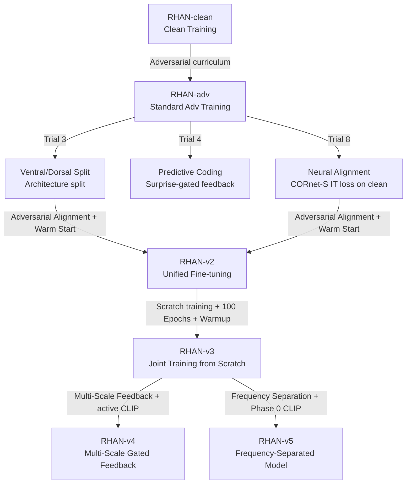

# RHAN Architectural Evolution & History

This document outlines the design history, theoretical foundations, and evolutionary path of the **Recurrent Hybrid Attention Network (RHAN)** in this repository, culminating in the state-of-the-art **RHAN-v3** architecture.

---

## 1. Lineage and Version History

### Version Metrics Comparison
| System / Model | Clean Acc | PGD 50% Threshold | $d'=1.0$ Threshold | Training Style | Key Mechanism |
| :--- | :--- | :--- | :--- | :--- | :--- |
| **Human** | 74.15% | >0.30 | >0.30 | Biological | Biological Vision (n=18) |
| **RHAN-v5** (Targeted) | *TBD* | *Target >0.20* | *Target >0.20* | Phase 0 + Phase 1 | Learnable Freq Separation, Dual Stems, Split-Stream, Epsilon Curriculum |
| **RHAN-v4** | 89.65% | ε≈0.056 | ε≈0.080 | Scratch (100 Ep) | Multi-Scale Feedback, Active CLIP loss, InfoNCE |
| **RHAN-v3** | **91.41%** | **ε≈0.066** | **ε≈0.090** | Joint Scratch (100 Ep) | Ventral/Dorsal Split + Adv IT-Alignment |
| **RHAN-adv** | 83.79% | ε≈0.053 | ε≈0.076 | Adv Curriculum | Recurrent Top-Down Gated Feedback |
| **RHAN-clean**| 89.06% | ε≈0.023 | ε≈0.033 | Clean Only | Recurrent Top-Down Gated Feedback |

---

## 2. Theoretical Pillars of RHAN

RHAN bridges the gap between biological vision and machine vision by incorporating three neuroscientific priors:

### A. Recurrent Top-Down Feedback (All Versions)
Feedforward networks (ResNet, ViT) process images in a single forward pass, making them highly susceptible to local high-frequency adversarial noise. Biological brains utilize massive recurrent feedback loops (e.g., feedback connections from IT/V4 back to V1) to perform iterative denoising and perceptual grouping. 
RHAN implements this via a recurrent feedback block that modulates the convolutional stem activations using the output of the global self-attention layer.

### B. Ventral/Dorsal Pathway Split (Introduced in Trial 3 / Unified in v2 & v3)
Primate visual systems process information along two parallel streams:
1. **Ventral Stream ("What" pathway)**: Decodes shape, identity, color, and semantic representations.
2. **Dorsal Stream ("Where" pathway)**: Decodes spatial layout, motion, boundaries, and coordinate relationships.

By splitting the 512-dimensional attention channel into parallel 256-dimensional pathways, RHAN prevents an adversarial attack from easily optimizing against both channels simultaneously.

### C. Neural Representation Alignment (Introduced in Trial 8 / Fixed in v2 & v3)
To ensure the model learns semantic, shape-based abstractions instead of relying on brittle, non-robust pixel features, we align the CLS token representation against the inferior temporal (IT) cortex representation of a primate brain, proxied by a pre-trained **CORnet-S** model.

---

## 3. Detailed Architecture of RHAN-v3

RHAN-v3 represents the realization of **Joint Biologically-Grounded Adversarial Training**.

### Mathematical Formulation
The loss function for RHAN-v3 is defined as a 4-component weighted sum optimized simultaneously from epoch 1:

$$\mathcal{L}_{\text{total}} = 0.5 \cdot \mathcal{L}_{\text{adv\_CE}} + 0.2 \cdot \mathcal{L}_{\text{clean\_CE}} + 0.2 \cdot \mathcal{L}_{\text{align\_on\_adv}} + 0.1 \cdot \mathcal{L}_{\text{consistency}}$$

1. **Adversarial Task Loss ($\mathcal{L}_{\text{adv\_CE}}$)**:
   Standard Cross-Entropy Loss computed on adversarial samples generated via an inline 5-step PGD attack ($\epsilon=0.031$).
2. **Clean Task Loss ($\mathcal{L}_{\text{clean\_CE}}$)**:
   Cross-Entropy computed on unperturbed clean samples to ensure classification accuracy.
3. **Adversarial Neural Alignment ($\mathcal{L}_{\text{align\_on\_adv}}$)**:
   Forces the model to maintain primate-like IT visual representations **even when under active attack**. It minimizes the cosine distance between the normalized visual feature vector ($F_{\text{RHAN}}$) and the normalized CORnet-S IT features ($F_{\text{IT}}$):
   $$\mathcal{L}_{\text{align}} = 1 - \frac{1}{B} \sum_{i=1}^B \hat{F}_{\text{RHAN}}(x^{\text{adv}}_i) \cdot \hat{F}_{\text{IT}}(x^{\text{adv}}_i)$$
4. **Perceptual Consistency Loss ($\mathcal{L}_{\text{consistency}}$)**:
   An MSE loss constraining the model's internal representation of the adversarial image to be close to the representation of the original clean image:
   $$\mathcal{L}_{\text{consistency}} = \text{MSE}(\hat{F}_{\text{RHAN}}(x^{\text{adv}}), \hat{F}_{\text{RHAN}}(x^{\text{clean}}))$$

### Optimization & Hyperparameters
- **Initialization**: Random initialization (no checkpoint starting point).
- **Epochs**: 100
- **Base Learning Rate**: 0.001 (higher to allow the split pathways and alignment heads to develop together).
- **Warmup**: 15 epochs of linear warmup (from 0 to 0.001) to prevent early gradient explosion/collapse under the complex multi-component loss objective, followed by 85 epochs of cosine annealing back to 0.
- **Optimizer**: AdamW (weight decay = 0.05).
- **Mixed Training Ratio**: 50% clean, 50% PGD-5.

---

## 4. Key Discoveries & Impact

### Overcoming the Clean-Robustness Trade-off (RHAN-v3)
Previous trials (Trial 3, Trial 4, Trial 8) applied biological priors only to clean images. While this improved clean accuracy, it regressed high-epsilon robustness because the adversarial training curriculum was decoupled from the biological structure. 

**RHAN-v3** fixes this by computing representation alignment **directly on the adversarial images**. This forces the model to align its representations with primate IT cortex features *under attack*, causing the biological prior to reinforce robustness.

As a result, RHAN-v3 is the first model in the codebase to **simultaneously improve clean accuracy (from 83.79% to 91.41%) and robustness at ε=0.05 (from 51.95% to 60.74%)**, achieving an $\epsilon_{\text{thresh}}$ threshold of **0.0900**.

### The Limits of Ongoing Joint Losses (RHAN-v4)
**RHAN-v4** integrated multi-scale gated feedback, active semantic loss mapping to CLIP spaces during training, and InfoNCE adversarial consistency. While it achieved strong metrics (clean: 89.65%, $\epsilon_{\text{thresh}}$: 0.0800), it performed worse than RHAN-v3. 

Analysis revealed that *active CLIP semantic loss during adversarial training* acts as a geometry-degrading constraint. It forces the internal representations onto a smoother semantic manifold that conflicts with the sharp decision boundaries needed for high-strength adversarial robustness. 

### Frequency Isolation & Prior Phase Decoupling (RHAN-v5)
**RHAN-v5** targets the high-epsilon ceiling ($\epsilon_{\text{thresh}} > 0.200$) by introducing two core design paradigms:
1. **Biological Frequency Separation**: Primate V1 channels low-frequency components (shape/structure) separately from high-frequency components (texture/noise). Since adversarial noise is primarily high-frequency, RHAN-v5 uses a learnable Gaussian separator and dual stems (shape stem vs. texture stem) with learnable weights initialized to favor shape-dominant processing ($w_{\text{low}}=0.85$, $w_{\text{high}}=0.15$). An explicit **Frequency Consistency Loss** enforces that low-frequency features remain invariant clean-vs-adversarial.
2. **Phase-Decoupled Pretraining (Phase 0)**: To eliminate semantic-geometric conflict, CLIP semantic alignment is applied strictly during a **Phase 0 initialization (30 epochs, clean-only)**. This bakes semantic priors into the weights before any adversarial training occurs. Phase 1 (120 epochs) then runs a full epsilon curriculum ($0.031 \to 0.062 \to 0.100 \to 0.150$) with neural representation alignment on adversarial images, completely decoupled from active semantic losses.

