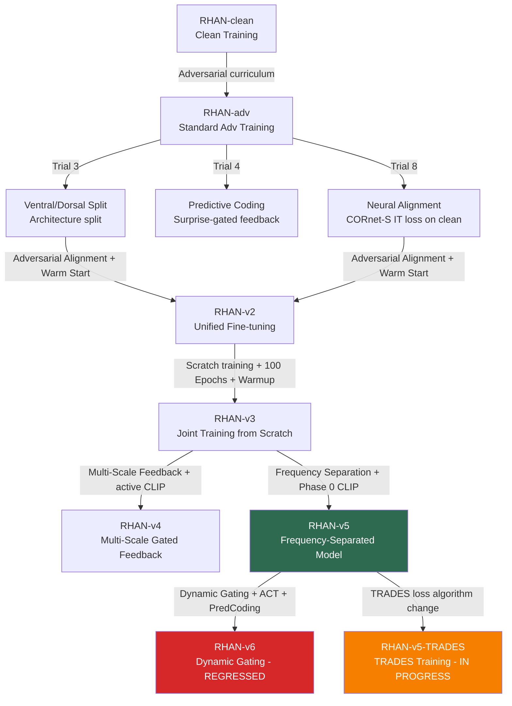

# RHAN Architectural Evolution & History

This document outlines the design history, theoretical foundations, and evolutionary path of the **Recurrent Hybrid Attention Network (RHAN)** in this repository, culminating in **RHAN-v5** (current best, εthresh=0.103) and the ongoing **RHAN-v5-TRADES** training experiment.

---

## 1. Lineage and Version History

### Version Metrics Comparison
| System / Model | Clean Acc | PGD 50% Threshold | $d'=1.0$ Threshold | Training Style | Key Mechanism |
| :--- | :--- | :--- | :--- | :--- | :--- |
| **Human** | 74.15% | >0.30 | >0.30 | Biological | Biological Vision (n=18) |
| **RHAN-TRADES-Hardened** ★ BEST | **86.33%** | **ε≈0.086** | **ε≈0.1246** | SGD Fine-tuning (30 Ep) | Class-hardened TRADES + IT align + inter-class margin |
| **RHAN-v5-TRADES** | 87.30% | ε≈0.078 | ε≈0.1151 | SGD Scratch (120 Ep) | Standard TRADES + IT alignment |
| **RHAN-v5** | 84.57% | ε≈0.071 | ε≈0.1030 | Phase 0 CLIP + Phase 1 Curriculum | Learnable Freq Separation, Dual Stems, Split-Stream |
| **RHAN-v3** | 91.41% | ε≈0.066 | ε≈0.0900 | Joint Scratch (100 Ep) | Ventral/Dorsal Split + Adv IT-Alignment |
| **RHAN-v4** | 89.65% | ε≈0.056 | ε≈0.0800 | Scratch (100 Ep) | Multi-Scale Feedback, Active CLIP loss, InfoNCE |
| **RHAN-adv** | 83.79% | ε≈0.053 | ε≈0.0764 | Adv Curriculum | Recurrent Top-Down Gated Feedback |
| **RHAN-clean**| 89.06% | ε≈0.023 | ε≈0.0330 | Clean Only | Recurrent Top-Down Gated Feedback |
| **RHAN-v6** ⚠️ | 82.03% | — | Regressed | Phase 0 + 6-Phase Curriculum | Dynamic Gating, PredCoding Error, ACT Pondering |
| **RHAN-trades-curriculum** 🔄 | *Training* | — | *Target >0.150* | SGD 3-Phase Curriculum (60 Ep) | Multi-stage epsilon curriculum (0.062->0.100->0.150) |

### RHAN Series PGD Accuracy Table (Verified)
| Epsilon | Hardened | TRADES | RHAN-v5 | RHAN-v3 | RHAN-adv | ResNet-18 | ViT-Small |
|---------|----------|--------|---------|---------|----------|-----------|-----------|
| 0.00 | 86.33% | 87.30% | 84.57% | 91.41% | 83.79% | 95.82% | 97.80% |
| 0.01 | 83.01% | 84.77% | 80.66% | 85.35% | 77.93% | 75.57% | 55.18% |
| 0.05 | 67.19% | 65.82% | 61.13% | 60.74% | 51.95% | 2.84% | 8.80% |
| 0.10 | 43.16% | 37.89% | 34.38% | 26.17% | 17.77% | 0.21% | 2.78% |
| 0.20 | 8.59%  | 5.47%  | 2.73%  | 1.17%  | 0.59%  | 0.02% | 1.12% |
| 0.30 | 0.20%  | 0.20%  | 0.20%  | 0.00%  | 0.00%  | 0.00% | 0.58% |

---

## 2. Theoretical Pillars of RHAN

RHAN bridges the gap between biological vision and machine vision by incorporating three neuroscientific priors:

### A. Recurrent Top-Down Feedback (All Versions)
Feedforward networks (ResNet, ViT) process images in a single forward pass, making them highly susceptible to local high-frequency adversarial noise. Biological brains utilize massive recurrent feedback loops (e.g., feedback connections from IT/V4 back to V1) to perform iterative denoising and perceptual grouping. 
RHAN implements this via a recurrent feedback block that modulates the convolutional stem activations using the output of the global self-attention layer.

### B. Ventral/Dorsal Pathway Split (Introduced in Trial 3 / Unified in v2 & v3)
Primate visual systems process information along two parallel streams:
1. **Ventral Stream ("What" pathway)**: Decodes shape, identity, color, and semantic representations.
2. **Dorsal Stream ("Where" pathway)**: Decodes spatial layout, motion, boundaries, and coordinate relationships.

By splitting the 512-dimensional attention channel into parallel 256-dimensional pathways, RHAN prevents an adversarial attack from easily optimizing against both channels simultaneously.

### C. Neural Representation Alignment (Introduced in Trial 8 / Fixed in v2 & v3)
To ensure the model learns semantic, shape-based abstractions instead of relying on brittle, non-robust pixel features, we align the CLS token representation against the inferior temporal (IT) cortex representation of a primate brain, proxied by a pre-trained **CORnet-S** model.

---

## 3. Detailed Architecture of RHAN-v3

RHAN-v3 represents the realization of **Joint Biologically-Grounded Adversarial Training**.

### Mathematical Formulation
The loss function for RHAN-v3 is defined as a 4-component weighted sum optimized simultaneously from epoch 1:

$$\mathcal{L}_{\text{total}} = 0.5 \cdot \mathcal{L}_{\text{adv\_CE}} + 0.2 \cdot \mathcal{L}_{\text{clean\_CE}} + 0.2 \cdot \mathcal{L}_{\text{align\_on\_adv}} + 0.1 \cdot \mathcal{L}_{\text{consistency}}$$

1. **Adversarial Task Loss ($\mathcal{L}_{\text{adv\_CE}}$)**:
   Standard Cross-Entropy Loss computed on adversarial samples generated via an inline 5-step PGD attack ($\epsilon=0.031$).
2. **Clean Task Loss ($\mathcal{L}_{\text{clean\_CE}}$)**:
   Cross-Entropy computed on unperturbed clean samples to ensure classification accuracy.
3. **Adversarial Neural Alignment ($\mathcal{L}_{\text{align\_on\_adv}}$)**:
   Forces the model to maintain primate-like IT visual representations **even when under active attack**. It minimizes the cosine distance between the normalized visual feature vector ($F_{\text{RHAN}}$) and the normalized CORnet-S IT features ($F_{\text{IT}}$):
   $$\mathcal{L}_{\text{align}} = 1 - \frac{1}{B} \sum_{i=1}^B \hat{F}_{\text{RHAN}}(x^{\text{adv}}_i) \cdot \hat{F}_{\text{IT}}(x^{\text{adv}}_i)$$
4. **Perceptual Consistency Loss ($\mathcal{L}_{\text{consistency}}$)**:
   An MSE loss constraining the model's internal representation of the adversarial image to be close to the representation of the original clean image:
   $$\mathcal{L}_{\text{consistency}} = \text{MSE}(\hat{F}_{\text{RHAN}}(x^{\text{adv}}), \hat{F}_{\text{RHAN}}(x^{\text{clean}}))$$

### Optimization & Hyperparameters
- **Initialization**: Random initialization (no checkpoint starting point).
- **Epochs**: 100
- **Base Learning Rate**: 0.001 (higher to allow the split pathways and alignment heads to develop together).
- **Warmup**: 15 epochs of linear warmup (from 0 to 0.001) to prevent early gradient explosion/collapse under the complex multi-component loss objective, followed by 85 epochs of cosine annealing back to 0.
- **Optimizer**: AdamW (weight decay = 0.05).
- **Mixed Training Ratio**: 50% clean, 50% PGD-5.

---

## 4. RHAN-v5: Frequency Separation & Phase-Decoupled Pretraining

**RHAN-v5** is the current best model ($\epsilon_{\text{thresh}} = 0.103$). It introduced two core design paradigms:

### A. Biological Frequency Separation
Primate V1 channels low-frequency components (shape/structure) separately from high-frequency components (texture/noise). Since adversarial noise is primarily high-frequency, RHAN-v5 uses a learnable Gaussian separator and dual stems (shape stem vs. texture stem) with learnable weights initialized to favor shape-dominant processing ($w_{\text{low}}=0.85$, $w_{\text{high}}=0.15$). An explicit **Frequency Consistency Loss** enforces that low-frequency features remain invariant clean-vs-adversarial.

### B. Phase-Decoupled Pretraining (Phase 0)
To eliminate semantic-geometric conflict (identified in v4), CLIP semantic alignment is applied strictly during a **Phase 0 initialization (30 epochs, clean-only)**. This bakes semantic priors into the weights before any adversarial training occurs. Phase 1 (120 epochs) then runs a full epsilon curriculum ($0.031 \to 0.062 \to 0.100 \to 0.150$) with neural representation alignment on adversarial images, completely decoupled from active semantic losses.

### C. Verified Results
- **Clean Accuracy**: 84.57%
- **εthresh (d'=1.0)**: 0.1030
- **M-Pathway Dominance**: Confirmed (wL=0.791 > wH=0.513)
- **No gradient masking**: PGD-20 vs PGD-100 gap < 8%

---

## 5. RHAN-v6: Dynamic Gating — Regression Analysis

**RHAN-v6** attempted to extend v5 with three additional mechanisms:
1. **Dynamic Frequency Gating**: Input-dependent α(x) gating instead of static learned weights
2. **Predictive Coding Error**: Top-down prediction error signals modulating recurrent feedback
3. **Adaptive Computation Time (ACT)**: Learned halting for variable-depth recurrence

### Why v6 Failed
The 6-phase epsilon curriculum ($0.015 \to 0.031 \to 0.062 \to 0.100 \to 0.150 \to 0.250$) was too aggressive. **Phase F (ε=0.250)** corrupted learned representations — the model could not maintain clean accuracy while defending against perturbations that exceed the information content of 32×32 CIFAR images. ACT maxed out its pondering budget on every sample, indicating the training regime was asking the model to solve an impossible task.

**Key lesson**: The architecture was not the problem — the training algorithm was. This motivated the pivot to TRADES on the proven v5 architecture.

---

## 6. RHAN-v5-TRADES and TRADES Hardening Experiments

Instead of adding architectural complexity, we focused on refining the **training objective** and **adversarial constraints** on the proven RHAN-v5 architecture.

### A. RHAN-v5-TRADES Baseline
Optimized using the standard TRADES loss (KL divergence formulation, $\beta=6.0$) and IT alignment (0.2 weight).
- **Initialization**: CLIP zero-shot weights (`rhan_v5_clip_init.pth`)
- **Epsilon**: $\epsilon=0.031$
- **Epochs**: 120 epochs
- **Results**: Clean test accuracy reached **87.30%**, and robustness threshold $\epsilon_{\text{thresh}}$ reached **0.1151** (d'=1.0 boundary), a significant step up from standard RHAN-v5.

### B. RHAN-TRADES-Hardened
To combat class collapses where similar categories (such as automobile/truck) fell to 0.00% under AutoAttack, we designed class-hardened training:
- **Epsilon Scaling**: Base $\epsilon=0.031$ scaled to $\epsilon=0.055$ (1.77×) for vulnerable classes (`automobile`=1, `truck`=9, `horse`=7, `dog`=5, `cat`=3).
- **APGD inner loop**: Generated adversarial examples using a custom 20-step adaptive APGD step with milestone-based halving and backtracking.
- **Inter-class margin loss**: Added centroid distance penalty ($\text{margin}=0.5$) with 0.20 weight on adversarial features.
- **Results**: Fine-tuned for 30 epochs, pushing $\epsilon_{\text{thresh}}$ to **0.1246** (a **4.2×** improvement over ResNet-18). However, AutoAttack standard evaluation revealed that `automobile` and `truck` robust accuracies remained at 0.00%, showing that boundary geometry near these classes is a deep representational problem.

### C. RHAN-trades-curriculum (Current Experiment - In Progress)
To push boundaries across all classes and achieve the target $\epsilon_{\text{thresh}} > 0.150$, we launched the Extended Curriculum training script starting from the hardened checkpoint:
- **Schedule**: 3 phases of 20 epochs each (60 epochs total):
  - **Phase A**: $\epsilon = 0.062$, step_size = 0.015, beta = 6.0 (Epochs 1-20)
  - **Phase B**: $\epsilon = 0.100$, step_size = 0.025, beta = 6.0 (Epochs 21-40)
  - **Phase C**: $\epsilon = 0.150$, step_size = 0.030, beta = 5.0 (Epochs 41-60)
- **Joint Loss**: $\mathcal{L}_{\text{total}} = \mathcal{L}_{\text{trades}} + 0.15 \cdot \mathcal{L}_{\text{align}} + 0.10 \cdot \mathcal{L}_{\text{margin}}$.
- **Goal**: Expand boundary margins across the board, utilizing Cosine Annealing learning rate (0.01 -> 0.0001) for robust parameter updates.

---

## 7. Key Discoveries & Impact

### Overcoming the Clean-Robustness Trade-off (RHAN-v3)
Previous trials (Trial 3, Trial 4, Trial 8) applied biological priors only to clean images. While this improved clean accuracy, it regressed high-epsilon robustness because the adversarial training curriculum was decoupled from the biological structure. 

**RHAN-v3** fixes this by computing representation alignment **directly on the adversarial images**. This forces the model to align its representations with primate IT cortex features *under attack*, causing the biological prior to reinforce robustness.

As a result, RHAN-v3 is the first model in the codebase to **simultaneously improve clean accuracy (from 83.79% to 91.41%) and robustness at ε=0.05 (from 51.95% to 60.74%)**, achieving an $\epsilon_{\text{thresh}}$ threshold of **0.0900**.

### The Limits of Ongoing Joint Losses (RHAN-v4)
**RHAN-v4** integrated multi-scale gated feedback, active semantic loss mapping to CLIP spaces during training, and InfoNCE adversarial consistency. While it achieved strong metrics (clean: 89.65%, $\epsilon_{\text{thresh}}$: 0.0800), it performed worse than RHAN-v3. 

Analysis revealed that *active CLIP semantic loss during adversarial training* acts as a geometry-degrading constraint. It forces the internal representations onto a smoother semantic manifold that conflicts with the sharp decision boundaries needed for high-strength adversarial robustness. 

### Phase Decoupling Breakthrough (RHAN-v5)
**RHAN-v5** resolved the semantic-geometric conflict by strictly separating CLIP pretraining (Phase 0) from adversarial training (Phase 1). Combined with biological frequency separation, this achieved the **new best εthresh of 0.1030** — a 14.4% improvement over v3.

### Architecture vs. Algorithm (RHAN-v6 → TRADES)
**RHAN-v6** proved that adding architectural complexity (dynamic gating, predictive coding, ACT) to an already-effective architecture produces diminishing or negative returns when the training regime is not carefully calibrated. The pivot to TRADES represents a fundamental insight: **the training algorithm, not the architecture, is now the bottleneck for further robustness gains**.
