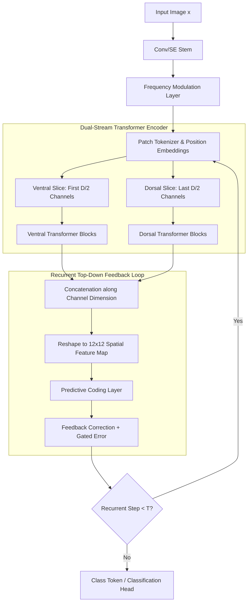

# Primate-Inspired Vision: Recurrent Hybrid Attention Network (RHAN) Architectural Specification

This document provides a mathematical and code-level specification of the **Recurrent Hybrid Attention Network (RHAN)** architecture, spanning both the base model (`RHANUnifiedSTL10`) and the scaled ViT-B model (`RHANLargeSTL10`).

---

## 1. Structural Overview

RHAN is designed around neuroscientific principles of human vision, specifically targeting:
* **Parallel Ventral/Dorsal streams** (separating content from geometric layout).
* **Predictive Coding feedback loops** (top-down modulation for denoising).
* **Self-supervised Temporal Difference in Vision (TDV)** (learning visual invariance from motion).



---

## 2. Component Specifications & Mathematical Equations

### A. Convolutional Stem & Squeeze-and-Excitation (SE) Blocks
The stem extracts low-level local spatial features. In the base model, we use layers 1–2 of a pretrained ResNet-50. In the large model, we use a custom wide convolutional stem (`WideSEConvStemLarge`) with residual shortcuts and channel-wise squeeze-and-excitation blocks.

#### Squeeze-and-Excitation Equations
For a feature map $X \in \mathbb{R}^{B \times C \times H \times W}$:
1. **Global Average Pooling (Squeeze)**:
   $$z_c = \mathcal{F}_{\text{sq}}(X_c) = \frac{1}{H \times W} \sum_{i=1}^{H} \sum_{j=1}^{W} X_c(i, j)$$
2. **Channel-wise Gate Generation (Excitation)**:
   $$s = \sigma(W_2 \cdot \text{ReLU}(W_1 \cdot z))$$
   Where $W_1 \in \mathbb{R}^{\frac{C}{r} \times C}$ and $W_2 \in \mathbb{R}^{C \times \frac{C}{r}}$ represent linear layers with a reduction ratio $r=16$, and $\sigma$ is the Sigmoid activation function.
3. **Scale Operation**:
   $$\tilde{X}_c = \mathcal{F}_{\text{scale}}(X_c, s_c) = s_c \cdot X_c$$

---

### B. Learnable Frequency Modulation
To decouple shape from high-frequency texture noise (a common vulnerability of feedforward neural networks), RHAN uses a learnable frequency analyzer at the output of the convolutional stem.

#### Frequency Filter Equation
Given conv stem activations $F_{\text{stem}} \in \mathbb{R}^{B \times C \times H \times W}$, we apply a channel-wise gating parameter $w_{\text{freq}} \in \mathbb{R}^{C}$:
$$F_{\text{modulated}} = F_{\text{stem}} \odot \sigma(w_{\text{freq}})$$
Where $\odot$ represents channel-wise multiplication and $\sigma$ is the Sigmoid function, mapping values to $[0, 1]$.

---

### C. Ventral / Dorsal Pathway Split
Primate visual systems bifurcate processing into the **Ventral ("What")** stream for object identification and the **Dorsal ("Where")** stream for spatial layout. RHAN mimics this by splitting the transformer's representation channel-wise.

#### Splitting and Fusion Equations
Let $T \in \mathbb{R}^{B \times L \times D}$ be the input tokens (where $L$ is sequence length and $D$ is embedding dimension):
1. **Bifurcation**:
   $$T_{\text{ventral}} = T[:, :, :D/2] \in \mathbb{R}^{B \times L \times D/2}$$
   $$T_{\text{dorsal}} = T[:, :, D/2:] \in \mathbb{R}^{B \times L \times D/2}$$
2. **Parallel Transformer Encoding**:
   $$Z_{\text{ventral}} = \text{VentralTransformer}(T_{\text{ventral}})$$
   $$Z_{\text{dorsal}} = \text{DorsalTransformer}(T_{\text{dorsal}})$$
3. **Re-combination (Fusion)**:
   $$Z_{\text{combined}} = \text{Concat}(Z_{\text{ventral}}, Z_{\text{dorsal}}) \in \mathbb{R}^{B \times L \times D}$$

---

### D. Top-Down Recurrent Feedback & Predictive Coding
In standard networks, feedback is absent. In RHAN, the high-level semantic representation (transformer outputs) predicts the low-level spatial features (CNN stem). Only the prediction error is allowed to update the representation.

#### 1. Recurrent Modulation
Let $S_t \in \mathbb{R}^{B \times D \times H \times W}$ be the spatial representation reconstructed from step $t$ transformer tokens. We modulate the original stem features $F$ as:
$$F_{\text{feedback}} = \text{Conv}_{1 \times 1}(S_t)$$
$$G_t = \sigma(\text{Conv}_{1 \times 1}(F_{\text{feedback}}))$$
$$F_{\text{modulated}} = F + G_t \odot F_{\text{feedback}}$$

#### 2. Predictive Coding Denoising
We formulate the top-down prediction of $F_{\text{modulated}}$ from $S_t$ as:
$$\text{Prediction: } P = \text{Predictor}(S_t) = \text{Conv}_{1 \times 1}(\text{GELU}(\text{GroupNorm}(\text{Conv}_{3 \times 3}(S_t))))$$
$$\text{Error Map: } E = F_{\text{modulated}} - P$$
$$\text{Error Gate: } G_E = \sigma(\text{Conv}_{1 \times 1}(\text{GELU}(\text{Conv}_{1 \times 1}(E))))$$
$$\text{Corrected Feature: } F_{t+1} = F_{\text{modulated}} + \alpha \odot G_E \odot E$$
Where $\alpha \in \mathbb{R}$ is a learnable scaling factor (`error_scale`). This gate limits the error propagation to high-discrepancy regions.

---

### E. Self-Supervised Temporal Difference in Vision (TDV)
TDV enforces physical, temporal constraints on features extracted from consecutive frames. For consecutive video frames $x_t$ and $x_{t+1}$:
1. **Feature Extraction**:
   $$z_t = \text{Backbone}(x_t), \quad z_{t+1} = \text{Backbone}(x_{t+1})$$
2. **Causal Motion Prediction**:
   The motion encoder generates a vector $m_t$ representing visual shift:
   $$m_t = \text{MotionEncoder}(x_t, x_{t+1})$$
   We project features into a low-dimensional prediction space:
   $$\hat{z}_t = \text{TDVHead}(z_t), \quad \hat{z}_{t+1} = \text{TDVHead}(z_{t+1})$$
   Enforcing the causal consistency:
   $$\hat{z}_t + m_t \approx \hat{z}_{t+1}$$

#### Loss Formulation
The total TDV pretraining loss is composed of prediction, variance, and covariance terms:
$$\mathcal{L}_{\text{TDV}} = 25.0 \cdot \mathcal{L}_{\text{pred}} + 25.0 \cdot \mathcal{L}_{\text{var}} + 1.0 \cdot \mathcal{L}_{\text{cov}} + 25.0 \cdot \mathcal{L}_{\text{var\_raw}}$$

1. **Prediction Loss**:
   $$\mathcal{L}_{\text{pred}} = \text{MSE}(\hat{z}_t + m_t, \text{detach}(\hat{z}_{t+1}))$$
2. **Variance Regularization (VICReg)**:
   Encourages features to vary across the batch to prevent mode collapse (forcing feature dimension standard deviation $\ge 1.0$):
   $$\mathcal{L}_{\text{var}} = \frac{1}{d} \sum_{j=1}^{d} \max\left(0, 1 - \sqrt{\text{Var}(\hat{z}_{t,j}) + \epsilon}\right) + \frac{1}{d} \sum_{j=1}^{d} \max\left(0, 1 - \sqrt{\text{Var}(\hat{z}_{t+1,j}) + \epsilon}\right)$$
3. **Covariance Regularization (Decorrelation)**:
   Forces feature dimensions to be linearly independent:
   $$\mathcal{L}_{\text{cov}} = \frac{1}{d} \sum_{i \neq j} \left(C_{ij}\right)^2, \quad \text{where } C = \frac{1}{B-1} \sum_{b=1}^{B} (z_b - \bar{z})(z_b - \bar{z})^T$$

---

## 3. Code Walkthrough to Mathematical Mapping

Below, we detail how the PyTorch class implementations correspond to the mathematical operations:

### 1. `PredictiveCodingLayerSTL`
Defined in [model_rhan_stl10_pretrained.py](file:///home/ferrarikazu/Adversarial%20Cognitive%20Model/phase1_training/model_rhan_stl10_pretrained.py#L6-L26):
```python
class PredictiveCodingLayerSTL(nn.Module):
    def __init__(self, channels=512):
        super().__init__()
        # Predictor mapping S_t to P (Conv 3x3 -> GN -> GELU -> Conv 1x1)
        self.predictor = nn.Sequential(
            nn.Conv2d(channels, channels, 3, padding=1, bias=False),
            nn.GroupNorm(16, channels), nn.GELU(),
            nn.Conv2d(channels, channels, 1, bias=False),
        )
        # Error Gate mapping E to G_E (Conv 1x1 -> GELU -> Conv 1x1 -> Sigmoid)
        self.error_gate = nn.Sequential(
            nn.Conv2d(channels, channels // 4, 1), nn.GELU(),
            nn.Conv2d(channels // 4, channels, 1), nn.Sigmoid(),
        )
        # Learnable scaling factor alpha
        self.error_scale = nn.Parameter(torch.ones(1))

    def forward(self, local_f, global_spatial):
        predicted = self.predictor(global_spatial)          # P = self.predictor(S_t)
        error = local_f - predicted                         # E = F - P
        gate = self.error_gate(error)                       # G_E = self.error_gate(E)
        corrected = local_f + self.error_scale * gate * error # F_corrected = F + alpha * G_E * E
        return corrected, error.abs().mean()
```

### 2. `RHANUnifiedSTL10` (Bifurcation and Modulation Loop)
Defined in [model_rhan_stl10_pretrained.py](file:///home/ferrarikazu/Adversarial%20Cognitive%20Model/phase1_training/model_rhan_stl10_pretrained.py#L141-L168):
```python
    def _run_transformer(self, spatial_features):
        B = spatial_features.shape[0]
        tokens_2d = self.token_proj(spatial_features)
        tokens = tokens_2d.flatten(2).transpose(1, 2)
        cls = self.cls_token.expand(B, -1, -1)
        tokens = torch.cat([cls, tokens], dim=1)
        tokens = tokens + self.pos_embed

        # --- Ventral/Dorsal channel splitting (D=512 -> 256 + 256) ---
        v_tokens = self.ventral(tokens[:, :, :256])
        d_tokens = self.dorsal(tokens[:, :, 256:])
        
        # --- Fusion ---
        combined = torch.cat([v_tokens, d_tokens], dim=-1)

        cls_out = combined[:, 0, :]
        spatial_out = combined[:, 1:, :]
        spatial_map = spatial_out.transpose(1, 2).reshape(B, 512, 12, 12)

        return cls_out, spatial_map

    def get_features(self, x):
        f = self.stem(x)
        # --- Learnable Sigmoid Frequency modulation ---
        freq_w = torch.sigmoid(self.freq_weights).view(1, 512, 1, 1)
        f = f * freq_w

        # --- Recurrent predictive coding loops (T=3 steps) ---
        for step in range(3):
            cls, spatial_map = self._run_transformer(f)
            f, _ = self.predictive_coder(f, spatial_map)

        return cls
```

### 3. `RHANLargeSTL10` (Recurrent Feedback class)
Defined in [model_rhan_stl10_large.py](file:///home/ferrarikazu/Adversarial%20Cognitive%20Model/phase1_training/model_rhan_stl10_large.py#L124-L169):
```python
class RecurrentFeedbackLarge(nn.Module):
    def forward(self, transformer_output, stem_features, transformer_fn):
        current = transformer_output
        f = stem_features
        # Recurrent feedback loop (T=2 steps)
        for t in range(self.num_recurrent_steps):
            cls_token = current[:, :1, :]
            spatial = self.tokens_to_spatial(current)    # Reconstruct 12x12 feature map
            feedback = self.feedback_conv(spatial)       # FeedbackConv(S_t)
            g = self.gate(feedback)                      # Gate G_t
            f_modulated = f + g * feedback               # F_modulated = F + G_t * feedback
            
            # Predictive Coding Correction Step
            f, _ = self.predictive_coder(f_modulated, spatial)
            
            modulated_tokens = self.spatial_to_tokens(f, cls_token)
            current = transformer_fn(modulated_tokens)   # Re-evaluate Ventral/Dorsal Transformer
        return current
```

---

## 4. Key Differences: Base vs. Large

| Architectural Feature | `RHANUnifiedSTL10` (Base) | `RHANLargeSTL10` (Large) |
|---|---|---|
| **Parameters** | ~18M | ~52M |
| **Stem Backbone** | Pre-trained ResNet-50 (Layers 1-2) | `WideSEConvStemLarge` (Wide residual CNN stem) |
| **Embed Dimension** ($D$) | 512 | 768 |
| **Channel Splits** | 256 Ventral / 256 Dorsal | 384 Ventral / 384 Dorsal |
| **Transformer Blocks** | 3 layers | 8 layers |
| **Attention Heads** | 8 (4 per stream) | 12 (6 per stream) |
| **Recurrent Loops** | 3 loops (in-place `get_features`) | 2 loops (re-evaluating `RecurrentFeedbackLarge`) |
| **Activation Checkpointing** | No | Yes (`torch.utils.checkpoint.checkpoint`) |
