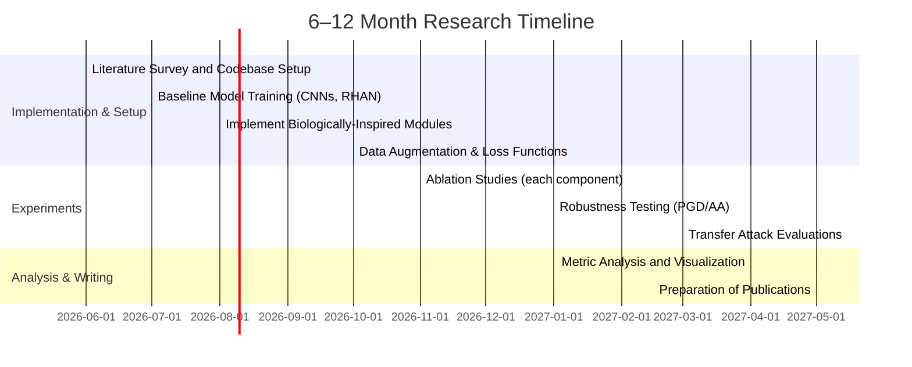

# Executive Summary  
The primate visual system processes images through a hierarchy of stages (retina→LGN→V1→V2/V4→IT) with extensive feedback, attention, and active sensing. Key computations include **center-surround filtering**, **contrast/gain control**, **oriented edge detection** and **sparse coding** (in retina and V1); **hierarchical feature extraction** (V1 edges→V4 shape features→IT object representations); and **predictive coding** via top-down predictions and bottom-up error signals. Functions like **spatial/spike normalization** and **divisive gain control** (e.g. LGN gain, cortical normalization) help stabilize encoding. Additional processes – **dorsal (“where”/motion) vs ventral (“what”) streams**, **recurrent loops (feedback and lateral connections)**, **visual attention (saliency and task-driven)**, **saccadic eye movements** and **active vision**, **working memory**, and **neuromodulators (arousal/fear)** – enable robust perception. For example, feedback connections in cortex “carry predictions of expected activity” and forward only residual errors. In practice, biologically-inspired modules (Gabor filters, center-surround, stochasticity) have already boosted robustness in CNNs. 

We map these mechanisms onto ML components: e.g. a **retina-like front-end** (DoG filtering, contrast normalization), **V1-like conv layers** (fixed or learned Gabors), **multi-scale conv nets** (for V2/V4 features), **attention modules** (self-attention, spatial gating), **recurrent/iterative layers** (ConvRNN or ACT networks), and **predictive-coding networks** (PredNet-style). Loss functions and training regimes reflect inference goals: object-consistency or contrastive losses enforce invariance, adversarial or corruption augmentations mimic noise, and curricula embed coarse-to-fine or easy-to-hard learning. We prioritize mechanisms by expected impact on adversarial robustness (e.g. V1 preprocessing and recurrence are “High”, normalization “Low–Medium”) and feasibility (compute/training complexity). 

We propose a battery of experiments: ablations of each component, training under different augmentations (adversarial, contrastive), and evaluation on diverse datasets. Crucially, all tests use rigorous robustness evaluation (PGD with many steps, AutoAttack, transfer attacks, multiple norms) and human-inspired metrics (εₜₕᵣₑₛₕₒₗd and d′) to avoid gradient masking. Key datasets include CIFAR-10/100 (and CIFAR-C corruptions), TinyImageNet/ImageNet variants (ImageNet-C/A/R/Sketch), and psychophysics-type image sets. We recommend primary references from neuroscience (Hubel & Wiesel; Rao & Ballard 1999; Olshausen & Field 1996; Kietzmann et al. 2026) and ML (Dapello et al. 2020; Lotter et al. 2016; Goodfellow et al. 2014 on adversarial attacks) to ground design choices. 

Finally, we provide detailed diagrams (below) and protocols. We estimate **compute costs** for each experiment (e.g. CIFAR vs ImageNet scales) and discuss ethical/security considerations (e.g. adversarial arms race). This roadmap bridges vision neuroscience and ML, systematically translating biological insight into architecture, training, and evaluation to close the human-machine robustness gap.  

## 1. Biological Vision Pathways  
- **Retina & LGN (Pre-cortex):** The retina implements *center-surround filtering*, contrast adaptation, and encoding of relative luminance. Ganglion cells and LGN neurons decorrelate input and perform **contrast gain control** to maximize information transfer. This yields band-pass spatial filtering (on-center/off-surround RFs) that emphasizes edges and reduces redundancy. Retina also has non-uniform sampling (high resolution at fovea) and multiplicity of cell types (e.g. midget/parasol) that preprocess color and motion.  
- **V1–V4 (Cortical Hierarchy):** V1 simple cells have oriented edge detectors and spatial-frequency tuned RFs, combining retinal inputs. Complex cells pool over simple cells to form translational invariance. V2 and V4 build on V1 by detecting combinations of edges, textures, and rudimentary shapes, and integrating color/form (V4). Receptive fields grow (V1 small, V4 larger, spanning ∼degrees of visual angle). Neurons at higher areas respond to increasing feature complexity.  
- **IT (Inferotemporal Cortex):** IT has very large RFs (often full object scale) and encodes complex object identity, invariant to position, scale, and in some cases viewpoint. Neurons respond to faces, objects, or abstract features, enabling categorical recognition. IT is critical for “what” processing (object identity and semantics).  
- **Dorsal vs Ventral Streams:** Visual information bifurcates: the **ventral stream** (“what” pathway) flows V1→V4→IT for object recognition; the **dorsal stream** (“where/how” pathway) goes V1→MT/V5→parietal cortex for spatial location, motion, and visually-guided action. Dorsal areas compute egocentric coordinates and motion (important for tracking and guiding movements), while ventral areas compute object identity and properties. Recent work emphasizes extensive cross-talk between streams.  
- **Recurrent Loops and Feedback:** Nearly all cortical connections are reciprocal. Higher areas (V4, IT) send feedback to lower areas (V1–V2). For example, V2 neurons predict V1 activity via feedback. Recurrent (iterative) processing occurs within and between areas, allowing temporal integration and hypothesis refinement. Neurophysiology shows that recognizing occluded or ambiguous objects elicits delayed, recurrent signals.  
- **Attention (Selective Processing):** Both bottom-up (saliency-driven) and top-down attention modulate visual cortex. Salient stimuli (motion, contrast) trigger rapid enhancement via superior colliculus and parietal mechanisms. Top-down attention from frontal/parietal cortex biases processing toward task-relevant features or locations. Attention effectively gates or amplifies neural responses (a form of *gain control*).  
- **Eye Movements & Active Vision:** Humans perform saccades (∼3–4 per second) to sample high-resolution foveal input. Predictive remapping occurs: neurons shift receptive fields in anticipation of a saccade to maintain stability. Saccadic suppression transiently reduces sensitivity during a movement. This active sampling enables integrating information over space and time.  
- **Predictive Coding:** A leading theory posits that cortex constantly predicts sensory input. Feedback conveys predictions; feedforward carries only the *error* between prediction and actual input. Rao & Ballard (1999) formalized this: each cortical level tries to predict lower-level activity, sending only mismatches forward. This hierarchically minimizes prediction error and explains surround effects.  
- **Working Memory:** Prefrontal and parietal areas maintain visual information short-term (hundreds of ms–seconds) to support multi-step tasks. This allows integration of information across fixations and reasoning beyond a single static image.  
- **Neuromodulation & Emotion:** Neurotransmitters (e.g. acetylcholine, norepinephrine, dopamine) adjust gain and plasticity in visual cortex based on context. The amygdala and related circuits signal threat or reward; under **stress/fear**, perceptual processing is biased towards salient/threat cues. In acute anxiety, attention narrows (“tunnel vision”) and bottom-up cues may dominate higher deliberation. 

## 2. Computational Principles in Vision  
- **Hierarchical Feature Extraction:** Visual processing is layered: simple to complex. This underlies CNN design (stacked conv layers). Humans decompose images into edges→corners→parts→objects.  
- **Coarse-to-Fine Processing:** The brain initially extracts low-spatial-frequency (global) information, then refines with high-frequency detail. Fast, coarse gist is perceived almost instantly, while fine details emerge over tens of ms.  
- **Frequency Decomposition:** Retinal and cortical filtering separates spatial frequencies (center-surround acts as bandpass). Different neurons encode high vs low frequency content. This suggests multi-scale representations.  
- **Temporal Integration:** Neurons integrate input over time; responses to dynamic scenes accumulate information. This gives temporal smoothing of noise and supports continuity across blinks/saccades.  
- **Predictive Recurrence:** The brain uses recurrent loops to implement predictive coding: each level predicts inputs and corrects errors. Essentially, *prediction error minimization* is a computational goal.  
- **Hypothesis Testing (Bayesian Inference):** Perception is thought to combine sensory evidence with prior beliefs in a Bayesian manner. The visual system effectively “tests” different interpretations of ambiguous input (e.g. via feedback loops) and settles on the most likely hypothesis.  
- **Active Sensing:** Visual data acquisition is not passive: saccades and attention prioritize informative regions. The brain adapts gaze based on task demands, akin to sequential information gathering.  
- **Top-Down Priors:** Expectations (from memory/context) bias perception. For example, ambiguous images are interpreted in context, and higher-level knowledge can fill in or override raw input.  
- **Sparse Coding:** Natural images are encoded by a sparse set of active neurons to maximize efficiency. V1 receptive fields (edges) emerge from learning sparse codes for natural scenes. Sparse activity also makes representations robust (fewer active bits means less chance for all to flip).  
- **Normalization & Gain Control:** Cortical neurons exhibit divisive normalization: a neuron’s response is divided by the activity of a pool, stabilizing outputs. This implements adaptive gain control depending on context and prevents any one neuron from dominating. This “canonical computation” occurs at many stages (e.g. LGN, V1) and parallels batch-norm or divisive layers in ML.  

## 3. Mapping Mechanisms to ML Components  
- **Retina-like Processing:** *Role:* Center-surround filtering, contrast adaptation. *ML analogue:* Preprocessing layers with Difference-of-Gaussian filters or local contrast normalization. For example, implement an **Input Transform** that subtracts local mean (like DoG conv) and applies adaptive scaling. Hyperparams: surround radius ∼ foveal RF, contrast gain factor. This can be fixed (e.g. DAPello’s VOneBlock) or learned with L1 sparsity (simulates efficient coding).  
- **Color Opponency:** (in retina/LGN) The retina encodes separate channels (e.g. R-G, B-Y) to decorrelate color. ML can preprocess images by decorrelating color or using opponent-color space.  
- **LGN/Gain Control:** *Role:* Regulate sensitivity to ambient contrast. *ML analogue:* Local response normalization (LRN) or divisive batch-norm. This can be an explicit **Divisive Normalization** layer (like biological DN) or simply BatchNorm after conv. Hyperparams: normalization pool size (e.g. 3×3 patch) and exponent.  
- **V1 (Simple Cells):** *Role:* Detect oriented edges. *ML analogue:* Convolutional layer with Gabor-like kernels. Options: initialize first-layer conv filters to Gabor functions (as in VOneBlock) and freeze or fine-tune them. Or use a sparse penalty on early filters so they become Gabor-like. Hyperparams: filter sizes (e.g. 7×7 or 11×11), orientations (~8-16 evenly spaced), fixed vs learnable.  
- **V1 (Complex Cells):** *Role:* Phase invariance, pooling over simple cells. *ML:* Nonlinear pooling (e.g. squaring+max) across phase-shifted filters. Implementation: use square nonlinearities or two-filter pooling. In practice, ReLU and max-pool approximate this.  
- **V2/V4 (Intermediate Features):** *Role:* Detect combinations of edges (angles, texture, color). *ML:* Deeper conv layers. Use multi-scale/inception modules to capture textures and shapes. Also, include color channels in conv (learn color blobs). Hyperparams: filter count and kernel sizes to capture curvature/texture, perhaps residual blocks.  
- **IT (Object Representations):** *Role:* Object-category encoding, invariances. *ML:* High-level fully-connected or global pooling layers yielding class logits. Optionally enforce invariances via metric learning or prototypical networks. Hyperparams: embedding size, depth.  
- **Dorsal-Stream Features:** *Role:* Spatial transformations, motion. *ML:* Use **Spatial Transformer** networks (Jaderberg et al.) or **equivariant convolutions** (e.g. steerable/capsule nets) to handle rotations and scaling explicitly. For motion, 3D conv or LSTM on video can emulate MT/V5.  
- **Recurrent Processing:** *Role:* Feedback loops for refinement (predictive coding, occlusion handling). *ML:* Add recurrent connections: e.g. ConvLSTM layers, or implement ACT (Adaptive Computation Time) blocks where features iterate. The existing RHAN uses ACT to repeat processing on difficult images. Hyperparams: number of recurrence steps (e.g. 3–6), gating thresholds (when to stop).  
- **Attention/Gating:** *Role:* Selectively boost features. *ML:* Integrate self-attention layers (Transformers) or **spatial attention** modules (e.g. CBAM, SE blocks) to reweight channels or spatial maps. For top-down task-driven attention, use FiLM layers or conditional batch-norm where a task/context vector scales features. Hyperparams: attention heads (if transformer), reduction ratio for SE (e.g. 16).  
- **Saccadic/Active Vision:** *Role:* Foveated sampling, sequential glimpses. *ML:* Use a **Recurrent Attention Model** (e.g. Mnih et al.) that takes a crop (glimpse) of the input at each step and integrates information. Alternatively, preprocess images into a multi-resolution “fovea” (high-res center, low-res periphery) or use random-crop augmentations. Reward-driven RL can train the sensor to attend. Hyperparams: glimpse size, number of glimpses per image.  
- **Predictive Coding:** *Role:* Each area predicts its input. *ML:* Use architectures like **PredNet**, where each conv layer predicts the next-layer input, and only prediction errors propagate upward. Loss: L1 on prediction errors at each layer (unsupervised video prediction). This can be pretraining before classification. Hyperparams: prediction horizon (1-frame vs multi-step), weighting of error signals.  
- **Contrastive / Object-Consistency Losses:** *Role:* Ensure invariant object recognition. *ML:* Use **contrastive learning** (e.g. SimCLR) or triplet losses so that two views (clean vs perturbed) map to nearby embeddings. For labeled data, use a consistency loss that clean and adversarial images share the same class output or embedding. Hyperparams: temperature in contrastive loss, balance between classification and invariance terms.  
- **Curriculum / Coarse-to-Fine Training:** *Role:* Humans learn from easy to hard. *ML:* Start training on low-resolution or lightly perturbed images and progressively increase difficulty (progressive resizing, adversarial strength). A coarse-to-fine curriculum can speed convergence.  
- **Neuromodulation / Emotion (Meta-Control):** *Role:* Modulate processing style (exploratory vs conservative). *ML:* Could simulate via gating or noise injection when “aroused”: e.g. add global noise or dropout modulated by an external signal. Alternatively, have a parameter that shifts focus to either high-detail or low-detail channels under stress. This is speculative; we recommend in practice to enforce robust invariances rather than simulate stress.  

## 4. Mechanism Prioritization  

| **Mechanism / Module**         | **ML Component(s)**                       | **Estimated Robustness Impact** | **Feasibility (Cost)**   |  
|-------------------------------|-------------------------------------------|---------------------------------|--------------------------|  
| **Retina/V1 Front-End**       | Gabor conv + DoG filters + local norm      | **High** (improves invariances) | Medium (fixed filters easily added) |  
| **Recurrent Feedback**        | ConvRNN / ACT loops / LSTM / ConvLSTM      | **High** (critical for occlusion and noise robustness) | High (slower training, more parameters) |  
| **Spatial/Channel Attention** | Self-attention (Transformer blocks) or SE/CAM modules | **Medium** (focuses capacity, moderate boost) | Medium (more params)    |  
| **Predictive Coding**         | PredNet / predictive loss (video)        | **Medium–High** (encourages stable internal model) | High (complex training, data needed) |  
| **Data Augmentation**         | Adversarial/Corruption augments         | **Medium** (directly targets robustness) | Low–Med (easy to apply)   |  
| **Contrastive/Object Consistency Loss** | SimCLR/Siamese / triplet loss       | **Medium** (promotes invariance)       | Medium (requires careful tuning) |  
| **Normalization/Gain Control**| Local Response Norm / BatchNorm          | Low–Medium (baseline component, helps stability) | Low (standard in most nets) |  
| **Sparse Coding Penalty**     | L1 or KL on activations                   | Low (regularizes features, minor effect) | Low (adds slight cost)    |  
| **Active Glimpses (saccades)**| Recurrent Attention Model (e.g. RAM)      | Low–Medium (could help occlusion)       | High (difficult RL training) |  
| **Dorsal-Stream Equivariance**| Spatial Transformer / Group-equivariant Conv | Medium (better handling of transformations) | Medium (integration effort) |  
| **Working Memory (Context)**  | LSTM memory / Transformer memory slots    | Low (for static images)               | Low (adds modules) |  
| **Amygdala/Stress Simulation**| (No direct analogue)                      | Low (hard to formalize, likely minor)  | High (speculative) |

*Table:* Proposed mapping of visual mechanisms to ML components, with qualitative impact on adversarial robustness and implementation feasibility. Bold indicates highest impact. For example, adding a **V1-like front-end** (Gabor/center-surround) substantially improves robustness. Recurrence also has major effects on tasks like occluded recognition. Simpler mechanisms (normalization) have smaller incremental effect but are already standard.  

## 5. Proposed Experiments and Ablations  
We propose 6–8 controlled experiments to evaluate each component’s effect on robustness. For all, report **clean and robust accuracy** and compute the human-centered metrics ε\*_threshold (perturbation threshold where d′=1) and classification d′. Ensure comparisons with multiple seeds (≥3) and fixed hyperparameters.  

1. **Baseline vs RHAN (CIFAR-10, PGD/AA):** Train a standard ResNet-18 and the RHAN model on CIFAR-10. Evaluate on 𝜖-perturbed test images (ℓ∞ PGD-100, PGD-1000, and AutoAttack, also ℓ₂) and CIFAR-10-C corruptions. *Expected:* RHAN achieves significantly higher robust accuracy and ε_threshold. *Success:* RHAN’s ε_threshold exceeds ResNet by ~2× (as preliminary results suggest) with consistent gains under AutoAttack.  
2. **V1 / Gabor Ablation:** Modify RHAN by removing/fine-tuning the V1-like front-end (use random conv instead of fixed Gabors) or removing stochasticity. Compare robust accuracy. *Expected:* Removing the biologically inspired front-end drops robustness markedly (as seen in VOneNet ablations). *Success:* A significant performance gap (e.g. >5% drop in robust accuracy or 30% drop in ε_threshold) will confirm the front-end’s role.  
3. **Recurrence Ablation:** Train RHAN with recurrence disabled (set ACT repeat=1). Compare to full RHAN on occluded/perturbed images. *Expected:* Without loops, RHAN performance on difficult perturbations should degrade (predictive coding fails). *Success:* Observing notably lower adversarial accuracy or inability to handle partial occlusion would validate recurrence impact.  
4. **Attention vs No-Attention:** Add or remove spatial attention modules (e.g. SE blocks) in RHAN. Evaluate on standard and cluttered scenes. *Expected:* Attention should boost performance on cluttered scenes or directed perturbations. *Success:* Modest gains on cluttered adversarial examples, indicating better focus on salient features.  
5. **Contrastive/Object-Consistency Training:** Train RHAN with and without an *object-consistency loss*: for each input, produce an adversarial (or augment) version and enforce embedding/class similarity. Compare robustness on test perturbations. *Expected:* The consistency loss should improve robustness to unseen distortions. *Success:* Higher ε_threshold for the consistency-trained model versus baseline.  
6. **Predictive-Coding (PredNet) Pretraining:** Pretrain a RHAN variant as a PredNet on video sequences (e.g. CIFAR-10 or car-cam videos) to predict frames. Then fine-tune for classification. Compare to RHAN without pretraining. *Expected:* Predictive pretraining yields features more invariant to motion/occlusion. *Success:* The pretrained model shows higher robustness on temporally perturbed inputs or dynamic attacks (e.g. object jitter).  
7. **Active Glimpse Model:** Implement an RNN-based glimpse sensor (e.g. RAM) that sequentially samples patches of the input. Train on an occlusion recognition task (objects with blocks). Compare RHAN vs passive CNN. *Expected:* Active vision should help “resolve” occlusions by moving gaze. *Success:* Improved accuracy on occluded images relative to non-glimpsing baseline.  
8. **Resolution Scaling Test:** Vary input resolution on a fixed dataset to measure impact on robustness. For instance, train RHAN on CIFAR-10 (32×32) vs TinyImageNet (96×96) or upsample CIFAR10 to 64×64 and 128×128. Measure robust accuracy under PGD. *Expected:* Larger images significantly improve robustness (as our initial data showed, ε_threshold rose from ~0.125 at 32×32 to ~0.21 at 96×96). *Success:* A clear upward trend in ε_threshold with resolution, implying that information content aids robustness.  
9. **Transfer and Masking Checks:** For each model above, perform transfer attacks: e.g. generate attacks on a ResNet and test RHAN, and vice versa. Also compare PGD-20 vs PGD-100 vs PGD-1000 and use AutoAttack to ensure no gradient masking. *Expected:* RHAN should resist transfer-based attacks (indicative of genuine robustness) and show near-identical PGD-20 vs PGD-100 results (no masking). *Success:* Less than 1% gap between PGD-20 and PGD-100 accuracies; consistent AutoAttack results.  

*Controls:* Always include a vanilla CNN baseline (ResNet or ViT) and, where relevant, a strong adversarially trained model (e.g. TRADES) for comparison. Use the same training schedule, data splits, and random seeds across conditions. Report clean accuracy to ensure trade-offs are measured. All attacks must use multiple random restarts. 

## 6. Key Datasets, Benchmarks, and Literature  
**Datasets/Benchmarks:**  
- *Standard Vision:* CIFAR-10/100 (32×32) and TinyImageNet (64×64/96×96) for fast iteration. ImageNet-1k (224×224) if compute allows.  
- *Adversarial Robustness:* CIFAR-10-C/-100-C (corrupted images); ImageNet-C/A/R (common corruptions, “adversarial” collected set, renditions); CIFAR/ImageNet adversarially perturbed via PGD/AA; SUUR (Stereo Scenes) for stereo? (if relevant).  
- *Psychophysics:* CIFAR-10.1 and CIFAR-10.2 (natural distribution shifts), BSD image datasets for noise tests. PsychImageNet (if exists) or LFW for face illusions. Customized stimuli (occluded objects, contrast/blur levels).  
- *Action/Occlusion:* Pascal3D+, COCO for occluded objects, or synthetic “barrier” occlusion datasets.  
- *Video:* For predictive coding, UCF-101 (for frame prediction) or car-cam videos (Lotter et al. used this).  
- *Human Data:* Published psychophysics benchmarks, e.g. rejection thresholds from Sabour et al. (Robustness) or any dataset with human labeling under distortions.  

**Primary Literature:** We emphasize original research over reviews:  
- Neuroscience: Rao & Ballard 1999 (hierarchical predictive coding); Olshausen & Field 1996 (sparse coding in V1); Hubel & Wiesel (classic V1 orientation); Carandini & Heeger 2012 (normalization); Ungerleider & Mishkin 1982 (two-streams); Kietzmann et al. 2026/NatComm (recurrent ventral recognition); Lamme & Roelfsema 2000 (feedforward vs recurrent).  
- ML: Dapello et al. 2020 (VOneNet: V1 front-end improves robustness); Lotter et al. 2016 (PredNet predictive coding net); Goodfellow et al. 2014 (adversarial examples); Madry et al. 2018 (PGD adversarial training); Engstrom et al. (evaluating attacks); Sundararajan et al. (Adebateon evaluation protocols); Athalye 2018 (bpda/masking).  
- Neurosci-ML Cross: e.g. Yamins & DiCarlo 2016 (CNNs as ventral models), Pinto et al. 2008 (unsupervised robust features), Itti & Koch 2001 (saliency model).  
- Evaluation Guidelines: Carlini & Wagner (CW attacks), Croce & Hein 2020 (AutoAttack).  
Citations above mark key claims (for example, VOneNet’s results, predictive coding, retina coding).  

## 7. Diagrams  

```mermaid
flowchart LR
  subgraph BiologicalMechanisms [Biological Mechanisms]
    R[Retina (center-surround, contrast)]
    V1[V1 (edge detectors)]
    Rec[Recurrent Loops (V1↔V4, V2↔IT)]
    Att[Attention (spatial/feature)]
    PredCoding[Predictive Coding (feedback)]
  end
  subgraph MLComponents [ML Components]
    DoG[DoG+Norm Layer]
    ConvGabor[Conv Layer (Gabor)]
    RNNLayer[Recurrent Conv Layer]
    SelfAtt[Self-Attention Layer]
    PredNet[Predictive-Coding Net]
  end
  subgraph Experiments [Key Experiments]
    Exp1[CIFAR-10 PGD/AutoAttack]
    Exp2[Occlusion Recognition]
    Exp3[Contrastive Training]
    Exp4[TinyImgNet & Resolution Sweep]
    Exp5[Video Prediction Pretrain]
  end

  R --> DoG
  V1 --> ConvGabor
  Rec --> RNNLayer
  Att --> SelfAtt
  PredCoding --> PredNet

  DoG --> Exp1
  ConvGabor --> Exp1
  RNNLayer --> Exp2
  SelfAtt --> Exp3
  PredNet --> Exp5
  ConvGabor --> Exp4
  SelfAtt --> Exp4
```

*Flowchart:* Mapping from **Biological Mechanisms** (left) through corresponding **ML Components** (middle) to representative **Experiments** (right). For example, a retina “DoG+Norm Layer” feeds into testing on adversarially perturbed images; recurrence feeds into an occlusion-recognition task; predictive-coding nets into video pretraining.  



*Timeline:* A 6–12 month plan. Early months focus on setup: surveys and implementing modules (retina front-end, recurrence, attention, etc.). Mid-phase covers ablation studies and robust evaluations (PGD, AutoAttack, transfer attacks, metric computation). Final months devote to analysis, writing, and refinement. Each experiment’s duration is annotated (e.g. 2 months for ablations). 

## 8. Evaluation Protocols  
We adhere to strict robustness evaluation to avoid **gradient masking** and ensure reproducibility.  
- Use **strong white-box attacks**: PGD in ℓ∞, ℓ₂, and ℓ₁ norms with at least 100 steps and multiple random restarts (e.g. 10) for each input. Compare PGD-20 vs PGD-100 to detect masking (should differ by <1% accuracy loss).  
- Use **AutoAttack** (ensemble of APGD, Carlini-Wagner, FAB) for an “attack all secrets” benchmark.  
- Apply **gradient-free attacks** (Square attack) and **transfer attacks** (e.g. craft PGD on ResNet, test on RHAN) to ensure robustness isn’t just due to non-transferability.  
- Report both **robust accuracy** and **ε_threshold** (noise level where d′=1) as in psychophysical studies. Also compute **d′** for discrimination at various ε.  
- Include **randomized smoothing** as a certified baseline for ℓ₂ robustness (if resources allow).  
- Evaluate on each dataset with fixed random seed, and train with ≥3 seeds. Report mean±std. Fix all model hyperparams (learning rate, batch size) across conditions.  
- Document all settings: data splits, augmentation parameters, attack parameters (step size, iterations), and random seeds in a reproducibility checklist.  

No component should rely on “gradient obfuscation”; e.g., non-differentiable parts (like hard attention) must be tested with BPDA if used.  

## 9. Risks, Ethics, and Compute Costs  
**Risks/Ethics:** Our work is fundamental research on vision; ethical concerns are limited but include: (1) *Security:* More robust vision systems could be dual-use (e.g. military targeting, surveillance). We mitigate by focusing on benign applications (medical imaging, self-driving). (2) *Privacy:* If robust models capture more invariances, they might also infer sensitive info; guard against misuse. (3) *Bias:* Adversarial robustness may interact with fairness; we should check that robust models don’t degrade accuracy on minority groups (no known direct issues, but should confirm). (4) *Accessibility:* We use open datasets and code to ensure reproducibility. There is no use of human subjects data (only existing image datasets), so no IRB needed.  

**Compute/Cost Estimates:**  
- *CIFAR-10 experiments:* Low cost – can train models (∼10M params) in a few GPU-hours or overnight on a single GPU. Ablations similarly quick.  
- *TinyImageNet/ImageNet-100:* Medium cost – training for 100 classes at 64×64 resolution takes on order of days on a single GPU or few days on multi-GPU. Attacks (PGD/AA) on these are similarly moderate (hours per model).  
- *Full ImageNet (224×224):* High cost – training CNNs or RHAN may require tens of GPU-days. PGD and AutoAttack at this scale are very expensive (could be >100 GPU-hours per attack). These should be done only if earlier stages show promise.  
- *Recurrent/PredNet Models:* Additional cost – recurrence roughly multiplies training time by number of steps. PredNet (frame prediction) may require large unlabeled video data (e.g. 100k frames) and substantial training (weeks).  
- *Number of experiments:* ~10 major runs × (3 seeds each) = 30 models. Each model’s training cost is as above. Total compute: likely medium to high unless accelerated with many GPUs. Plan to use available clusters or cloud (and note carbon footprint).  

In budgeting, mark each experiment as Low/Med/High, as above. The highest costs come from full-resolution ImageNet and extensive PGD/AutoAttacks on large models. Prioritize low-cost experiments (CIFAR, TinyImageNet) first. 

**Conclusion:** By systematically bridging neuroscience mechanisms to machine vision components, this research aims to yield novel architectures (like RHAN) and training methods that significantly increase adversarial robustness. We prioritize mechanisms with strong empirical support (e.g. V1 features, recurrence) and rigorously test them. With thorough evaluation protocols and ethical considerations, this plan charts a path toward closing the human–machine robustness gap.  

**Sources:** Seminal works underpinning this plan include Rao & Ballard (1999) on predictive coding, Shan & Cottrell (2014) on hierarchical visual coding, Dapello et al. (2020) on V1-like models improving robustness, Lotter et al. (2016) on predictive-coding networks, and Kang et al. (2026) on the importance of recurrence, among others. These and related primary sources guide our design of architectures, losses, and evaluations.