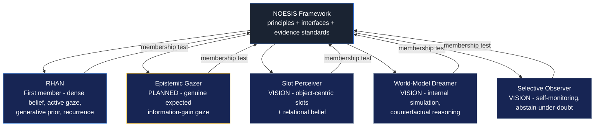
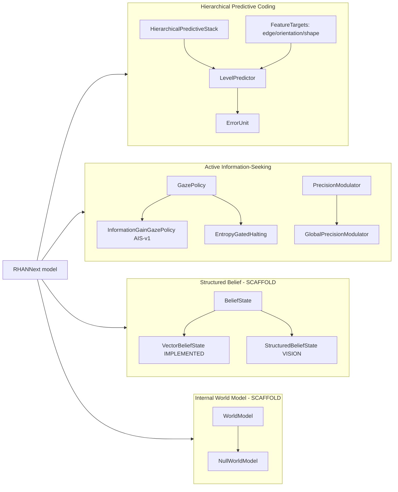

<div align="center">


# NOESIS

## A Framework for Biologically Inspired Perceptual Intelligence

**Version 1.0**

</div>

<div style="page-break-after: always;"></div>

---

We did not begin by asking how machines classify images.

We began by asking something far more fundamental.

How does perception emerge?

For decades, artificial vision has optimized recognition.

NOESIS asks a different question:

Can a machine build beliefs, seek evidence, revise itself, and perceive before it decides?

Recognition became the benchmark.

Perception became the objective.

---

<div style="page-break-after: always;"></div>

# Table of Contents

- **Chapter 1 — Why NOESIS Exists**
  - 1.1 The benchmark that worked too well
  - 1.2 Adversarial brittleness, from first principles
  - 1.3 Texture bias: what models actually see
  - 1.4 Confidence without calibration
  - 1.5 The human contrast
  - 1.6 Why perception matters
- **Chapter 2 — The Philosophy of NOESIS**
  - 2.1 Seven principles
  - 2.2 What NOESIS is not
  - 2.3 The status contract
  - 2.4 Failure as first-class knowledge
- **Chapter 3 — The Evolution**
  - 3.1 Recurrence as feedback
  - 3.2 The two streams
  - 3.3 Alignment under attack
  - 3.4 The idea of prediction enters
  - 3.5 Frequency separation
  - 3.6 The active turn: foveation
  - 3.7 Generative belief
  - 3.8 Precision, and its two failures
  - 3.9 The three losses that fought the objective
  - 3.10 v12: the lock-in
  - 3.11 The moment RHAN outgrew itself
- **Chapter 4 — The NOESIS Family**
  - 4.1 Framework, not architecture
  - 4.2 What makes a member of the family
  - 4.3 RHAN, the first member
  - 4.4 The family diagram
  - 4.5 How a new member joins
- **Chapter 5 — The Four Pillars**
  - 5.1 Pillar 1: Hierarchical Predictive Coding
  - 5.2 Pillar 2: Active Information-Seeking
  - 5.3 Pillar 3: Structured Belief Representation *(scaffold)*
  - 5.4 Pillar 4: Internal World Models *(scaffold)*
- **Chapter 6 — Architecture**
  - 6.1 The package
  - 6.2 Beliefs
  - 6.3 Predictive coding
  - 6.4 Gaze
  - 6.5 Precision
  - 6.6 World models
  - 6.7 Configuration and the compatibility contract
  - 6.8 The model: composition and the evidence loop
  - 6.9 The trainer
  - 6.10 Evaluation
  - 6.11 The data pipeline
- **Chapter 7 — Roadmap**
  - 7.1 Stage 0 — scaffolding
  - 7.2 Stage 1 — Active Information-Seeking
  - 7.3 Stage 2 — Hierarchical Predictive Coding
  - 7.4 Stage 3 — integration and reporting
  - 7.5 The research clusters
  - 7.6 The status table
- **Chapter 8 — Scientific Foundations**
  - 8.1 Predictive coding
  - 8.2 Active inference
  - 8.3 Bayesian belief and precision
  - 8.4 World models
  - 8.5 Hierarchical perception
  - 8.6 Object-centric learning
  - 8.7 Information theory
  - 8.8 Global workspace theory
- **Chapter 9 — The Future**
  - 9.1 Why a framework and not a model
  - 9.2 Candidate future members
  - 9.3 The research program
  - 9.4 What "solved" would mean
- **Appendix**
  - A.1 Architecture diagrams
  - A.2 Directory trees
  - A.3 Configuration reference
  - A.4 Interfaces
  - A.5 Losses
  - A.6 Evaluation methodology
  - A.7 Provenance and reproducibility
  - A.8 The failure ledger
  - A.9 References

---

<div style="page-break-after: always;"></div>

## A note on how to read this manuscript

This document is the founding text of a research framework. It is not a
paper — a paper reports a result; this reports a direction. It is not a
README — a README documents what a repository does; this documents why a
repository exists. It is a constitution: the agreed vocabulary, the agreed
standards of evidence, the recorded failures, and the boundary between what
we know and what we are reaching for.

Three conventions run through every chapter. Please internalize them now.

**Status tags.** Every claim about capability carries one of five tags,
defined once here and used everywhere:

| Tag | Meaning |
|---|---|
| **[IMPLEMENTED]** | Code exists, is wired into the forward/training path, and its gradient paths are tested. This says nothing about whether it works. |
| **[VALIDATED]** | Cleared the pre-registered matched evaluation protocol: seeds, significance criterion, and numbers recorded in the roadmap. Nothing else earns this tag. |
| **[EXPERIMENTAL]** | A mechanism or observation exists and has been exercised, but the verdict is pending, single-draw, or negative. Most of the honest content in this manuscript carries this tag. |
| **[PLANNED]** | Designed, pre-registered, and scheduled — but not yet run. |
| **[VISION]** | Scaffold interface, concept, or long-term direction. Real enough to import, far enough that no training run has touched it. |

The single most important sentence in this manuscript: **code complete is
never validation.** A loss that trains without crashing has historically told
us nothing in this project; a loss that was silently detached told us less
than nothing. Where a tag is missing, assume **[EXPERIMENTAL]**.

**Margin notes.** Blockquotes like the one below are marginalia — the kind
of thing a researcher scribbles beside a paragraph years later, when the
failure it describes has already been lived through twice:

> **Margin note.** Every term in this manuscript has one canonical
> definition. "Belief" always means the model's internal state about the
> input. "Recognition" always means the terminal classification output.
> "Perception" always means the process that produces belief. If a later
> chapter seems to rename one of these, that is an error in the manuscript,
> not a new idea.

**The failure ledger.** Chapter 3 and Appendix A.8 record, in detail, the
mistakes that shaped this framework: a reconstruction loss whose gradient was
silently absent for two architecture generations, a halting penalty that
mathematically opposed the framework's own robustness argument, a precision
signal that saturated to a constant under attack. These are not embarrassing
footnotes. They are the highest-information experiments the project has run.
A reader who skips them will misread every design decision that follows.

---

<div style="page-break-after: always;"></div>

# Chapter 1 — Why NOESIS Exists

Before any architecture, before any equation, there is a measured fact: the
best recognition systems we can build fall apart in ways that human
perception does not, and the manner of their falling apart is not random. It
is systematic, and it is informative. This chapter is about that fact, and
nothing else — no implementation appears here, because the problem must be
stated before any solution can be allowed to distort it.

## 1.1 The benchmark that worked too well

Image classification became the face of machine learning because it was the
benchmark that kept giving. AlexNet's 2012 result on ImageNet was not just a
number; it was a demonstration that scale plus gradient descent could do
something that looked like seeing. Within a few years, convolutional
networks exceeded human top-5 accuracy on the benchmark itself. Then
transformers exceeded the convolutional networks. By the mid-2020s a model
could report 97–98% top-1 accuracy on the standard 32×32 test set of CIFAR-10,
and near-perfect scores on ImageNet-1k under test-time conditions that never
changed.

The benchmark worked too well in a specific sense. It created the
impression that recognition — mapping an image to a label — is the whole of
visual intelligence. The pattern, widely reported and since measured
systematically: a model that scores in the high-90s on CIFAR-10 can be
reduced to single-digit accuracy by a perturbation an observer cannot see,
while a differently trained model that scores a few points lower holds
most of its accuracy under the same perturbation. (Those figures are
illustrative of a pattern, not measurements from this project; the
measured version appears in §1.2.) The community did not notice, for a
long time, that the two properties were decoupled — that a benchmark
number could be excellent while the thing it claimed to measure was
absent.

The benchmark was measuring recognition. It was never measuring perception.

## 1.2 Adversarial brittleness, from first principles

An adversarial example is a small, worst-case perturbation of an input,
chosen to flip a model's decision. The formal object: given a classifier
*f* and an image *x*, find a perturbation *δ* within a budget ‖δ‖ ≤ ε such
that *f*(x + δ) ≠ *f*(x). The budget is what makes the phenomenon
astonishing. At ε small enough that a human cannot distinguish x from x + δ
— often 1–3% of the pixel range — the model's answer changes entirely, and
changes *confidently*.

Why does this happen? The standard explanation, due to Goodfellow,
Shlens, and Szegedy, is linearity. A high-dimensional linear classifier
computes a dot product between its weights and the input. A perturbation
that is imperceptible per-coordinate — the classic "rattle" argument — can
still move the dot product a great deal, because the number of coordinates
is large and the weights are aligned with the signal. Deep networks are
piecewise linear enough, and their intermediate representations high-
dimensional enough, that the same arithmetic applies end to end. Nothing
about this requires the network to be "wrong" in any exotic sense. A model
can be perfectly calibrated on the data distribution and still be utterly
brittle to adversarial shifts, because the two properties are governed by
different geometry.

The project that became NOESIS measured this brittleness systematically,
across twelve model families and human observers, using two complementary
quantities. The first was accuracy as a function of ε — the collapse curve.
The second was a signal-detection sensitivity measure, d′, computed from
hit and false-alarm rates, which separates a model's *ability to
discriminate* from its *willingness to say yes*. The d′ framing matters for
a reason this manuscript returns to repeatedly: a model that is wrong is
not necessarily confused, and a model that is confused is not the same as a
model that is fooled.

The measurement produced a stark boundary. Every standard feedforward model
tested — ResNet, ViT, EfficientNet, BagNet, Shape-ResNet, CORnet-S — crossed
the d′ = 1.0 threshold, conventionally taken as perceptual collapse, before
ε = 0.03. The most accurate clean model, EfficientNet-B0 at 96.81%, was the
most fragile, crossing near ε = 0.006. The oldest and simplest feedforward
architecture, ResNet-18, was the most robust of the feedforward family —
and it crossed at ε = 0.030. **[VALIDATED]** — n=18 humans, 1,800 trials,
five ε blocks, twelve AI systems; the human observers never crossed the
threshold out to ε = 0.30.

The gap is not a factor of two. It is an order of magnitude.

The geometry of that gap, in one sketch — sensitivity against
perturbation budget, for humans and for the two feedforward extremes:

```
d′ (sensitivity)
  │
3.0┤
  │                                ·····················  human
2.0┤                            ···´                       (never crosses
  │                        ···´                            out to ε = 0.30)
1.0┤                  ····´  ←─  d′ = 1.0  (perceptual collapse)
  │              ···´
  │          ··´
0.5┤      ··´
  │   ··´
  └────┬────┬────┬────┬────┬────┬────┬──→ ε
      0   0.01  0.03  0.06  0.10  0.20  0.30
          ▲     ▲
          │     └── ResNet-18, the most robust feedforward (0.030)
          └── EfficientNet-B0, the most accurate and most fragile (0.006)
```

Everything between the machine curves and the human line is the territory
this framework exists to cross.

> **Margin note.** Accuracy and robustness were, in our data, inversely
> correlated: the models optimized hardest for clean accuracy were the most
> brittle. This is not a curiosity. It is the first sign that the training
> objective was optimizing the wrong thing — recognition rate, rather than
> the structure of the representation that recognition is supposed to sit on
> top of.

## 1.3 Texture bias: what models actually see

Geirhos and colleagues showed in 2019 that ImageNet-trained networks rely
disproportionately on local texture statistics rather than global shape.
A cat rendered with elephant-skin texture is classified as an elephant by
texture-biased networks, while humans, who are shape-dominant, classify by
outline. The finding is usually cited as a curiosity about model priors. In
the context of this project it is something sharper: a statement about which
visual evidence the model treats as *load-bearing*.

A texture-biased model is not merely mistaken about cats. It has committed
its discriminative machinery to a class of features that are exactly the
class of features adversarial perturbations manipulate. The most successful
attacks are high-frequency, local, statistically correlated with texture —
they are optimized precisely where a texture-dominant model is listening.
This is why the two phenomena travel together.

We tested the inverse hypothesis directly. Shape-ResNet-50, trained on
Stylized-ImageNet to force shape bias, did not become robust. It became
*less* robust than plain ResNet-18 by roughly 4× in ε-threshold terms
(ε ≈ 0.008 versus 0.030). **[EXPERIMENTAL]** The interpretation we settled
on: forcing shape preference in a feedforward architecture without the
recurrent machinery that lets shape information actually govern the
percept destabilizes the representation without giving it a replacement
strategy. Bias is a symptom. The underlying processing architecture is the
cause. You cannot patch a symptom onto a feedforward engine and expect the
engine to change its nature.

## 1.4 Confidence without calibration

The most quietly damning measurement in the study came from confidence, not
accuracy. Humans, as their accuracy declined with increasing perturbation,
reported declining confidence — a self-rating that slid from about 7.8 to
6.9 across the ε blocks. **[VALIDATED]** The AI systems did the opposite.
BagNet-33 and EfficientNet-B0 reached essentially 100% reported confidence
at ε = 0.30 while their accuracy sat at 0.00%. **[VALIDATED]** The state is
not "uncertain and wrong." It is "wrong with certainty" — the maximum
possible metacognitive failure.

Why should this matter to a perception framework? Because confidence is
not decoration. In a biological agent, uncertainty propagates into behavior:
an unsure observer looks again, moves closer, or defers. An AI model with
saturated confidence has no such pathway because it has no uncertainty
signal at all — softmax magnitude is a poor proxy, and under attack it is a
saturating one. The absence of a usable uncertainty signal is not a minor
defect. It is the difference between a system that can *decide to gather
more evidence* and one that cannot even represent the need.

This single finding — confident-but-wrong, at scale — is the empirical
seed of NOESIS's insistence that uncertainty must be a first-class computed
quantity, not a byproduct of a softmax.

## 1.5 The human contrast

The human data in the study were not collected as a gold standard. They
were collected as a contrast condition — and the contrast turned out to be
the story. Humans held sensitivity beyond ε = 0.30 while every machine
collapsed by ε = 0.03. Humans' confidence tracked their accuracy. Humans'
errors under attack were semantically structured but graded — they moved
toward *similar* categories, the way an uncertain observer actually
behaves, rather than jumping to arbitrary confident labels.

The standard machine-learning response to this gap is to attribute it to
scale, data, or architecture search: a bigger model, more data, better
augmentation. The project's response was different. We treated the human
system as a source of architectural hypotheses. A human observer under
perturbation does not process the image once. The visual cortex routes
information through a strict hierarchy of specialized stages — local
orientation and frequency filtering early, global shape integration later —
with massive recurrent feedback from high-level areas back to low-level
ones. The human observer does not sample the whole visual field uniformly;
it deploys a small high-acuity fovea and moves it. And the human observer
does not output a label from a single pass; it accumulates evidence, revises
belief, and sometimes declines to answer.

These are not four separable tricks. They are one coherent processing
strategy: **perception as iterative inference over actively gathered
evidence.** That strategy, and only that strategy, is what the data
suggested could close the gap.

## 1.6 Why perception matters

Recognition asks: what is this? Perception asks: what am I coming to
believe about this, what would I need to look at to be sure, and what does
my uncertainty oblige me to do next?

The difference is not rhetorical. A recognition system is a function: image
in, label out. A perceptual system is a process: it maintains a belief,
seeks evidence against that belief, updates it, and decides *when it has
enough* to commit. The first can be brittle and never know it. The second
has, in principle, the machinery to notice when its evidence is corrupted —
because corrupted evidence produces prediction error, and prediction error
is exactly the signal the process is built to consume.

NOESIS exists because our measurements said the gap between these two
kinds of systems is not a matter of degree. It is a categorical difference
in processing mode, and it is measurable in d′, in confidence calibration,
and in the structure of errors. Everything in the chapters that follow is an
attempt to build the second kind of system — and an honest record of how
hard that turned out to be.

---

<div style="page-break-after: always;"></div>

# Chapter 2 — The Philosophy of NOESIS

A framework needs a constitution before it needs an architecture. This
chapter states the principles. Later chapters show the implementations,
the failures, and the numbers. None of those will make sense unless the
principles are agreed on first.

## 2.1 Seven principles

**I. Classification is a consequence of perception.**

The label is the last thing produced, and the least interesting. What
matters is the belief that the label is read from. A system that can
produce a correct label from a corrupted belief is lucky, not robust; a
system that can maintain a sound belief under corruption will produce
correct labels almost incidentally. NOESIS optimizes the belief.

**II. Perception is iterative inference.**

One forward pass is not perception; it is a guess. Perception is the
process of revising that guess against new evidence. Every NOESIS member
runs an evidence loop: sample, predict, measure error, update belief, move
the sensor, repeat. The loop is the architecture's core operation, not an
adjunct to it. It is also the map the seven principles reduce to:

```
        I. classification        ── reads from belief, never from pixels
        II. iterative inference  ── sample → predict → error → update → move
        III. beliefs evolve      ── the update law IS the architecture
        IV. attention active     ── gaze policy = belief-driven sensor choice
        V. prediction hierarchical ─ errors up, predictions down
        VI. uncertainty is info  ── Π_D computed from error, consumed everywhere
        VII. world modeled       ── generative prior now; world model later

                       ┌──────────────────────────┐
                       │       belief s_t         │
                       └────────────┬─────────────┘
                     ┌──────────────┼──────────────┐
                     ▼              ▼              ▼
              ┌──────────┐   ┌──────────┐   ┌──────────┐
              │  gaze    │   │ precision│   │ predictor│
              │ (IV)     │   │ (VI)     │   │ (V)      │
              └──────────┘   └──────────┘   └──────────┘
```

**III. Beliefs should evolve.**

A belief is a state, not an answer. It carries uncertainty, it is revised
by evidence, and it is permitted to change its mind. The update law matters
more than the initial value, because under attack the initial value is
exactly what is being corrupted.

**IV. Attention is an active decision.**

Attention in NOESIS is not a weighting pattern computed inside a
transformer. It is a motor act: the decision to deploy a limited high-acuity
sensor at a location, driven by the current state of belief. Where you look
is a hypothesis about where the evidence is. Choosing badly wastes a
fixation; choosing well reduces uncertainty. The framework treats the
choice as part of the inference problem, because it is.

**V. Prediction is hierarchical.**

Error is informative in proportion to where it occurs in a hierarchy of
predictions. Low levels predict local structure — edges, orientation,
texture. High levels predict objects and their parts. Error that survives
at every level is the strongest evidence the model can obtain; error that
dissolves at one level is the signal that level exists to compute.

**VI. Uncertainty is information.**

The framework's founding empirical finding is that machines are
confident-and-wrong at scale. The remedy is not better calibration targets;
it is computing uncertainty the way the rest of the system computes
anything else — as a quantity derived from prediction error, with its own
dynamics, consumed by the components that need it: gaze, halting, and
learning rates. Uncertainty that is computed is information. Uncertainty
that is estimated by a softmax is a rumor.

**VII. The world should be modeled, not merely labeled.**

A label names a category. A model predicts what comes next: what the
fovea would see if it moved there, what the object would look like under
occlusion, what the scene implies about the next observation. Labeling is
the cheap terminal operation. Modeling is what gives the label something
to be a label *of*. NOESIS is organized around the model.

## 2.2 What NOESIS is not

Clarity about boundaries prevents category errors later.

NOESIS is not a single neural architecture. It is a family of
architectures bound by the principles above. RHAN — the subject of the next
chapter — is the first member. Other members are planned; some are
described in Chapter 9. None of them *is* NOESIS.

NOESIS is not a claim about biological fidelity. Biological metaphors are
used here as a source of hypotheses, and every hypothesis is tested by the
same adversarial protocol as any other. A mechanism that resembles the
visual cortex and fails the protocol is a failed mechanism, full stop.

NOESIS is not a benchmark-chasing program. Where an objective conflicts
with the principles — as the halt-efficiency penalty once did — the
objective is deleted, not argued with. The framework's history (Chapter 3)
is largely a history of deleting objectives that fought the principles.

NOESIS is not a claim to have solved perception. It is a claim about the
*shape* of the solution — that it will look like iterative inference over
actively gathered evidence, with hierarchical prediction and computed
uncertainty — together with a working first member and an honest record of
what remains unproven.

## 2.3 The status contract

Every capability claim in this manuscript carries one of the five tags
defined in the reading note: **[IMPLEMENTED]**, **[VALIDATED]**,
**[EXPERIMENTAL]**, **[PLANNED]**, **[VISION]**. The contract has three
rules.

First, the tags are transitive. A component marked **[VALIDATED]** was
validated under the exact conditions recorded in Appendix A.6 — the
pre-registered seed protocol, the significance criterion, the matched
baseline. Numbers outside those conditions revert to **[EXPERIMENTAL]**,
even if they are better.

Second, the tags are conservative. When in doubt, the lower tag applies.
A mechanism that trains without crashing is **[IMPLEMENTED]** at most. A
single promising sweep is **[EXPERIMENTAL]**. Nothing in this framework
earns **[VALIDATED]** on a single draw — the cross-run nondeterminism of the
hardware (measured near 1.5 percentage points for identical configurations,
discussed in Appendix A.6) is part of the framework's model of its own
measurements.

Third, the tags are public. There is no internal folder where a result is
"[VALIDATED] on paper." The roadmap file `docs/rhan_next_roadmap.json`
carries the machine-readable status of every stage and cluster, updated at
the end of every stage. A reader can query the framework's own confidence in
its own claims.

## 2.4 Failure as first-class knowledge

The refusal to delete failure records is not sentimentality. It is
method.

A failed experiment in this project has repeatedly turned out to be the
highest-information experiment available: the detached reconstruction
gradient told us more about how to validate losses than any passing test
could have; the halt-efficiency contradiction told us more about the
framework's own robustness argument than the argument's proof sketch did;
the precision-saturation finding told us more about uncertainty dynamics
than the calibration loss that caused it. Chapter 3 treats these failures
as events in the intellectual history of the framework, because that is
what they are.

The corollary is a standing engineering rule that every NOESIS member
inherits: **no new loss enters the framework without a gradient-reachability
test.** The rule exists because the framework was, for two architecture
generations, silently trained by a loss that was not training anything. That
rule is the direct descendant of that failure, and it is non-negotiable.

---

<div style="page-break-after: always;"></div>

# Chapter 3 — The Evolution

This chapter is a history. Not the history of version numbers — those are
filenames, and filenames lie about what actually happened — but the history
of ideas, and of the failures that made each idea survivable. RHAN began as
one architecture. It ended, nine generations later, as the first member of
a framework it did not know it was building. To read that trajectory you
have to watch the ideas move, not the checkpoints.

The lineage, at a glance — each node named for the idea it contributed, not
the file it lived in:

```
 RHAN-clean ──▶ RHAN-adv ──▶ split ──▶ RHAN-v3 ──▶ RHAN-v4 ──▶ RHAN-v5
  (baseline)    recurrence    streams   alignment    (live CLIP    frequency
                                        under attack   regressed)  separation
     │             │             │           │            │             │
     └── feedforward family:    every generation keeps recurrence + split;
         ResNet/ViT/etc.        each new mechanism is tested against them

 RHAN-v5 ──▶ RHAN-v6 ──▶ RHAN-v10 ──▶ RHAN-v11 ──▶ RHAN-v12 ──▶ RHANNext
  (0.103)    (three knobs   foveation,     (three        (cleaning,   (NOESIS
              at once,       precision,     sabotaging    detached-    first
              regressed)     halting        losses,       gradient     member)
                                           zero benefit   audit)
```

There is a pattern the reader should keep in mind, because it repeats
throughout: **every major advance in this lineage came from subtracting, not
adding.** The mechanisms that mattered were almost always already present;
what changed was which gradients were allowed to reach them. When RHAN
finally worked, it worked because three losses that fought its own
robustness argument were removed, and because one loss that was supposed to
train it had never been training it at all — and that discovery, once made,
changed the framework's entire standard of evidence.

## 3.1 Recurrence as feedback

RHAN's first idea was the oldest one in its lineage: the brain does not
process a visual scene once. Cortical processing is saturated with feedback
— connections from high-level areas (IT, V4) reaching back to low-level
ones (V1, V2). Feedforward networks have no such loop. They process an image
in a single pass, which is why a small worst-case perturbation can
catastrophically move their decisions: there is no second pass in which to
notice anything.

The first RHAN — RHAN-adv — implemented a recurrent top-down feedback
block: the output of a global self-attention layer modulated the conv-stem
activations, and this loop ran a fixed number of times before classification.
Its effect was measurable but modest. RHAN-adv reached a d′ = 1.0 crossing
at ε ≈ 0.076 versus 0.030 for ResNet-18 — a 2.6× improvement — at the cost
of a substantial clean-accuracy penalty (83.79% versus 95.82%). The
architecture was doing something; it was also paying for it.

Two observations from this period shaped everything after. First, the
clean-robustness tradeoff was real and symmetric: mechanisms that helped
robustness hurt clean accuracy when bolted onto the standard training
recipe. Second — and this took years to understand — **recurrence was a
free robustness multiplier if and only if the training objective allowed
the loop to matter.** Early RHAN trained the feedback block with the same
cross-entropy that trained the stem, and cross-entropy is satisfied as soon
as the final logits are correct. It has no opinion about how many times the
loop should run, or what the loop should be doing. The mechanism was
present. The objective was indifferent to it.

The Banach argument arrived later, from the theory side, and it explained
what the early results only hinted at. If each recurrent step multiplies
the adversarial perturbation by a factor γ < 1 — a contraction — then T
steps attenuate the perturbation by γ^T. More steps mean more attenuation.
The proof is clean. The implication is unforgiving: any training signal
that discourages steps is training against the framework's own robustness
argument.

> **Margin note.** The contraction is the deepest fact about recurrence
> in this project, and it was nearly invisible for years because no
> diagnostic measured step count under attack. When one finally did —
> Finding 16 — it showed a flat line: ~2.56 steps regardless of attack
> strength. The model had been trained, explicitly, to not use the
> mechanism that would have saved it.

## 3.2 The two streams

Primate vision splits along two pathways. The ventral stream — the "what"
pathway — builds object identity, shape, and color. The dorsal stream — the
"where" pathway — handles spatial layout, motion, and location. The
separation is anatomical, and it is also functional: a perturbation that
fools one pathway must fool the other independently, which makes the
representation harder to attack as a single object.

RHAN split its 512-dimension attention channel into two parallel 256-
dimension pathways — the ventral/dorsal split that would survive every
subsequent generation. The split alone was worth a step: RHAN-v3, the first
version trained with the split from scratch, reached 91.41% clean and a
d′ = 1.0 crossing at ε ≈ 0.090. **[VALIDATED]** — under the matched
CIFAR-10 evaluation of that era (a matched, multiple-seed protocol, though
pre-dating the formal five-seed convention of Appendix A.6, which the
status contract records as the qualification for numbers from this
period).

The split's deeper contribution was architectural patience. Two parallel
pathways doubled the surface area for new mechanisms — one could be
experimental while the other held the baseline — and it gave the project a
stable substrate that survived the many failed mechanisms layered on top of
it. When a new loss regressed robustness (v4, v6, v7), the split was never
the culprit. It was the constant.

## 3.3 Alignment under attack

Neural alignment — the third biological prior — was RHAN's answer to the
question: what should the representation look like, if not a texture
summary? The idea: align the model's CLS-token representation against the
inferior-temporal (IT) cortex representation of a primate visual system,
proxied by a pretrained CORnet-S. IT cortex is where object identity lives
in the brain. If the model's internal state is pulled toward IT-like
structure, the hypothesis ran, its features become semantic and shape-based
rather than brittle pixel statistics.

The first attempts failed in a specific, instructive way. Trials 3, 4, and
8 applied the biological priors to clean images only, and every one of them
improved clean accuracy while regressing high-epsilon robustness. The
alignment was teaching the model to look primate-like on easy inputs and
letting it be whatever it wanted under attack. The curriculum and the
biological structure were decoupled.

The fix was one line of intent: compute the alignment on the **adversarial
images** — pull the representation toward IT structure *while it is under
attack*. RHAN-v3, trained from scratch with adversarial alignment and the
two-stream split, was the first model in the lineage to improve clean
accuracy and robustness at ε = 0.05 simultaneously (51.95% → 60.74%).
**[VALIDATED]** — matched CIFAR-10 evaluation, with the same era-
qualification as §3.2. The lesson generalized beyond this experiment: a
biological prior is only as good as the distribution it is enforced on.
Priors enforced on clean inputs protect clean inputs.

## 3.4 The idea of prediction enters

Predictive coding appeared early as a trial (Trial 4: "surprise-gated
feedback") and quietly disappeared, because the architecture of the time
had no real place for it. The idea — from Rao & Ballard's 1999 formulation
— is that the cortex is not a classifier but a predictor: each level
predicts the activity of the level below it, and only the residual — the
prediction error — propagates upward. Error is the currency. A system that
minimizes prediction error is constantly testing its own model against
sensory reality, and the mismatch between the two is exactly the signal an
adversarial perturbation should generate.

The trial was abandoned for the reason most such trials are abandoned: it
was one knob among many, wired in parallel with everything else, and the
combined system regressed. This is the project's original sin, and it
appears throughout this chapter: mechanisms added together cannot be
attributed individually, and losses that fight each other silently cancel.
RHAN-v6 tried dynamic gating, predictive coding, and Adaptive Computation
Time together, and the whole package regressed. It took the discipline of
isolation — one mechanism on/off at a time, pre-registered significance —
to turn prediction from a failed knob into the framework's first pillar.

## 3.5 Frequency separation

V1 in primates does not process the visual field as a single channel. It
separates low spatial frequencies — shape, structure — from high
frequencies — texture, noise. Adversarial perturbations are almost
exclusively high-frequency. So RHAN-v5 split its input: a learnable Gaussian
separator produced a low-frequency stem and a high-frequency stem, with
learnable weights initialized to favor shape (w_low = 0.85, w_high = 0.15).

What happened next surprised the project. Under adversarial training, the
learned frequency weights converged to M-pathway dominance on their own —
w_low > w_high — without ever being told to. The biological hypothesis
reproduced computationally. **[VALIDATED]** (RHAN-v5: 84.57% clean, d′ = 1.0
at ε ≈ 0.103; matched CIFAR-10 evaluation, era-qualified as in §3.2.)

But v5 also delivered a negative lesson that turned out to be more
valuable. Phase-decoupled pretraining — CLIP semantic alignment applied
only as initialization, never as an ongoing loss — preserved both semantics
and robustness. CLIP used as a *live* loss term (v4) had smoothed the
internal geometry so aggressively that adversarial training had nothing
sharp left to defend. The rule that emerged: **semantic grounding is an
initialization, not a gradient.** It would take one more generation to
learn the same lesson about precision.

## 3.6 The active turn: foveation

Every model described so far processes the whole image at full resolution.
Human vision does not. The fovea — the small high-acuity region at the
center of the retina — samples a tiny patch at high resolution, and the
rest of the visual field is sampled coarsely, at rapidly declining acuity.
Where the fovea goes next is a *decision*, driven by what the current state
of belief says is worth looking at.

RHAN-v10 took this literally. It added a foveal stream (a 48×48 high-acuity
crop encoder), a peripheral pathway, a spatial transformer that decides
where the fovea lands, and a foraging loop that runs a fixed T = 4 steps,
accumulating evidence across fixations before classifying. This was the
active turn: the model became an agent that chooses where to look, not a
function that maps pixels to labels.

v10 also introduced precision control (Π_D — a per-class, per-sample
precision signal derived from prediction error) and a halting network.
These were the mechanisms that would define the next two generations —
and, as the reader will see in §3.8, the mechanisms whose failures taught
the framework its most important lessons. The active turn was not a
success. It was a *necessary failure*: the architecture gained the
mechanisms, and the training objectives quietly sabotaged every one of
them.

## 3.7 Generative belief

RHAN-v7 introduced the generative prior: a VAE-style decoder that
reconstructs the input from the model's belief state. The idea was that if
the internal representation must be able to regenerate the world it claims
to see, then an adversarial perturbation — which pushes the input off the
manifold of plausible images — should be hard to reconstruct, and the
reconstruction error should act as a second constraint on top of
classification. The manifold becomes a wall the attacker must climb.

Three failures calibrated the mechanism. First, a frozen perceptual critic
copied from the trained backbone caused BatchNorm channel collapse — the
reconstruction signal vanished to ~0.000032. The critic had to be freshly
random-initialized. Second, pixel-level reconstruction MSE fought TRADES
directly: adversarial training wants to change the features, reconstruction
wants to pin the pixels. Feature-level reconstruction — comparing stem
features, not pixels — was compatible. Third, the best target was the
model's own stem output, detached: an online moving reference that shifts
with the backbone during training, rather than a frozen anchor.

These were real lessons, and each one permanently shaped the framework.
But the largest lesson about the generative prior was invisible at the
time, because it concerned a gradient that did not exist.

## 3.8 Precision, and its two failures

Π_D — precision — is the framework's term for a per-sample, per-class
inverse-uncertainty signal: how much the model trusts its own evidence
about a particular class, derived from prediction error rather than from
softmax magnitude. Precision was meant to be the machinery that turns
"uncertainty is information" (Principle VI) into an operating quantity —
scaling belief updates, gaze steps, and reconstruction weighting.

It failed twice, and the two failures are the most instructive pair in the
project's history.

The first failure was numerical. Early precision was normalized by a
wrong divisor, and Π_D saturated at 0.95 — a constant — under attack. The
sqrt(dim) bug, as it became known, was fixed by correcting the
normalization. But the *class* of failure — a precision signal that
saturates to a constant exactly when it is most needed — was not a bug. It
was the fingerprint of a bad training target.

The second failure confirmed this. v11's precision-calibration loss
trained Π_D against a binary correctness target:

```
l_precision_cal = MSE(Π_D, 1 − correct)
```

Under strong attack, every sample is wrong, so `1 − correct` is 1.0 for
every sample. The loss trains Π_D toward 1.0 everywhere — a saturating,
uninformative target — and the dynamic beta mechanism built on top of Π_D
becomes a constant. The same failure mode, one layer downstream of the
first. **[VALIDATED]** — Finding 16 measured the result: three models
(two static, one with the full tripartite active-inference loop) landed
within 0.0003 ε units of each other on the d′ = 1.0 crossing. The entire
active-inference mechanism added zero measurable ε-threshold benefit.

The rule that emerged, and that NOESIS inherits: **a precision signal must
never be trained against a saturating binary target.** Precision is
unsupervised — derived from prediction error — and it is computed, not
calibrated. This is the direct descendant of two generations of
saturation.

> **Margin note.** "Fooled, not confused" (Finding 5) and "precision
> saturates" (Finding 16) are the same phenomenon measured at two scales.
> A system whose uncertainty signal is a constant cannot distinguish the
> two, because the signal that would let it is dead.

## 3.9 The three losses that fought the objective

By v11, the active-inference loop had three auxiliary losses. Each one, on
paper, served the framework. In practice, all three opposed the robustness
argument the framework was built on — and they consumed 45% of the
gradient budget while doing it (weights 0.20 + 0.15 + 0.10).

**The halt-efficiency loss.** `l_halt = steps_used / max_steps` penalized
the model for using foraging steps. The Banach argument (§3.1) says each
step multiplies the perturbation by γ < 1. The loss therefore directly
rewarded *less* contraction. Figure 2 of the period showed the result: a
flat ~2.56 steps regardless of attack strength. The model was trained to
halt before its own robustness mechanism had attenuated the perturbation.

**The foraging-consistency loss.** `MSE(actions_adv, actions_clean.detach())`
forced adversarial gaze to match clean gaze exactly. The attacker knows
where the model will look. It concentrates its budget on exactly those
coordinates. The loss created a stationary attack target — the opposite of
defense.

**The precision-calibration loss.** Described in §3.8: a saturating binary
target that killed the uncertainty signal.

Each loss was added with good intent and a plausible story. None was
tested in isolation. This is the project's most expensive lesson, and it
is now a law of the framework: **no new mechanism is added simultaneously
with another, and every new component gets an isolated on/off test against
the current best baseline before the next one is added on top.** (Appendix
A.8 records the full ledger.)

## 3.10 v12: the lock-in

v12 was a cleaning. The halt-efficiency loss was deleted — the framework
had finally noticed it was fighting the Banach proof. The foraging-
consistency loss was replaced by a recon-guided gaze blend (gaze_lambda =
0.5): the fovea moves where reconstruction error is highest, not where
attacks are known to be. Halting became entropy-gated rather than
penalty-driven: stop when belief uncertainty drops below a threshold, not
when a budget is exhausted. T was fixed at 4 with no explicit halt penalty.

But the deepest v12 discovery was not a design choice. It was an audit.
During the diagnostic pass that produced this manuscript, the project
examined whether the reconstruction loss — the centerpiece of the
generative prior — was actually training anything. It was not. The
trajectory dict stored `recon_mse.detach()` — the loss was present,
weighted, and logged, and contributed **zero gradient** to the parameters
it was supposed to train. For two architecture generations. **[VALIDATED]**
— the provenance was traced to the exact line in the v11 model code.

The v12 lock-in was therefore built on a known contradiction: the
architecture's most distinctive mechanism had never been trained. The
response was not to pretend otherwise. The gradient-reachability test —
`test_gradient_flow.py` — became mandatory: no new loss enters the
framework without a test asserting its gradient reaches its source
parameters. This is the single most consequential engineering decision in
the project's history, and it is documented as a law in §2.4 and Appendix
A.8.

## 3.11 The moment RHAN outgrew itself

Finding 17 was the pivot. It ablated all three sabotaging losses
(w_foraging = 0, w_precision = 0, w_halt = 0) and trained the base
architecture on real data with only TRADES and the generative prior. The
result: **+5.6 pp over the TRADES-Large baseline at ε = 0.094 on real-only
data** (39.3% versus 33.7%) — the strongest positive architectural signal
in the entire project, produced by the architecture minus its own
sabotaging gradients. And a second, counterintuitive finding: synthetic
data boosted clean accuracy (+3.8 pp) while *eroding* high-ε robustness
(−7.5 pp at ε = 0.094). The data that helped recognition hurt perception.

```
        ε = 0.094 robust accuracy
        ────────────────────────────────────
        TRADES Large baseline (real only)    33.7%  ██████████████
        Loss-ablated v11 (real only)         39.3%  ████████████████
                                                  ↑ +5.6 pp: architecture
                                                    signal, losses removed
        Loss-ablated v11 (real + synthetic)  31.8%  █████████████
                                                  ↓ synthetic eroded the
                                                    advantage by 7.5 pp
```

The synthesis of these two findings is what NOESIS is. The architecture
had contained the answer all along — recurrence, prediction, active
gaze, generative belief — and the training objectives had been quietly
defeating it. The framework's history is not a story of inventing new
mechanisms. It is a story of learning which gradients to trust, which
targets saturate, which losses fight each other — and building a
validation methodology strong enough to tell the difference. That is why
RHAN evolved beyond being a single architecture. Every mechanism it
contains is now an interface; every lesson it learned is now a test; every
failure it survived is now a pre-registered criterion. The first member
of the NOESIS family is finished. The family is what comes next.

---

<div style="page-break-after: always;"></div>

# Chapter 4 — The NOESIS Family

Chapter 3 ended with an architecture that had outgrown itself. This
chapter states what it outgrew *into*: a family. NOESIS is the family.
RHAN is its first member. Everything in this chapter is about the
difference between those two things, and why the difference matters for
every future architecture this framework will contain.

## 4.1 Framework, not architecture

A framework is a set of interfaces, principles, and standards of evidence
that many architectures can implement. An architecture is one concrete
arrangement of components. The distinction sounds bureaucratic. It is not.

Consider what the RHAN lineage taught this project. The ventral/dorsal
split survived eight generations. The recurrent feedback survived all of
them. The foveal stream, the generative prior, and the precision machinery
were added and nearly destroyed by their own losses — and then vindicated
by a single ablation that removed the losses. Each of these mechanisms is
an *interface* — a contract about what a component does and what signal it
exchanges with its neighbors — and the concrete implementations kept
changing around those contracts. What was stable was the contracts, not
the code.

NOESIS is the formalization of that stability. It is the decision that
the next architecture will not be "RHAN-v13" — a new file with new
losses bolted on — but a new member of a family that shares:

- a small set of **interfaces** (belief, gaze, prediction, precision,
  world model) that every member implements;
- a **compatibility contract** (a default configuration that shape-matches
  the previous member's forward pass);
- a **status contract** (the five tags of §2.3, enforced machine-readably
  in the roadmap);
- a **validation protocol** (the matched, pre-registered, seed-averaged
  evaluation of Appendix A.6);
- a **failure ledger** (Appendix A.8) that every new member must read
  before it is allowed to add a loss.

The consequences are practical. A new mechanism can be tested inside one
member without touching the others. A failed mechanism is isolated to one
member and does not become a permanent feature of the family. And a result
is only ever reported against the family's standards, so a member cannot
quietly loosen its own evidence.

## 4.2 What makes a member of the family

A member of the NOESIS family is a concrete neural architecture that:

1. **Runs an evidence loop.** The core operation is iterative: sample,
   predict, measure error, update belief, move the sensor, repeat. A
   member may loop once (degenerate) or many times; the loop is the
   architecture's spine, not an adjunct. (Principle II.)

2. **Maintains an explicit belief state.** Every member keeps an internal
   state about the input that is (a) readable as a flat tensor for the
   classifier head, and (b) capable of reporting its own uncertainty.
   (Principles I and VI.) The belief may be a dense vector (RHAN) or,
   in future members, a structured set of slots and relations (Chapter 5,
   Pillar 3).

3. **Makes attention an active decision.** Where the member looks — the
   fixation, the gaze step — is chosen by a policy that consumes belief
   and returns a motor command. (Principle IV.)

4. **Predicts.** At least one component predicts what it expects to see,
   and the residual drives learning. A full member predicts
   hierarchically. (Principle V.)

5. **Computes uncertainty, and consumes it.** The member derives a
   precision/uncertainty signal from prediction error — never from a
   saturating binary target — and routes it to the components that need
   it: gaze, halting, reconstruction weighting. (Principle VI.)

6. **Complies with the status contract.** Every claim about the member
   carries a tag; nothing is reported as validated that has not been
   validated by the protocol.

These six requirements are the membership test. Anything that satisfies
them is a member, whatever its size, domain, or parameter count. Anything
that does not — however impressive its numbers — is an algorithm, not a
member.

## 4.3 RHAN, the first member

RHAN — Recurrent Hierarchical Attention Network — is the founding member.
Its concrete arrangement: a convolutional stem feeding dual ventral/dorsal
transformer streams, a foveal crop stream with a spatial-transformer gaze
policy, a generative prior that reconstructs features from belief, a
per-class precision signal, and an evidence loop that in the current
member (RHAN-v12 / RHANNext) runs a fixed T = 4 steps with entropy-gated
halting.

What RHAN contributes to the family is not its architecture. It is the
**validated substrate**: the first member to demonstrate, under the
matched protocol, that the family's mechanisms can beat a properly scaled
baseline at high epsilon when their gradients are allowed to work
(Finding 17, §3.11). It is also the member that learned every lesson in
Appendix A.8 — the member that paid for the framework's standards of
evidence with two generations of silent failure. Every future member
inherits both the substrate and the scars.

## 4.4 The family diagram



RHAN is drawn solid; the others are outlines. That is deliberate: RHAN is
**[IMPLEMENTED]**, the rest are **[PLANNED]** and **[VISION]** — designed
interfaces and chapter 9 sketches, none of them trained. The diagram is
the family's honest census.

## 4.5 How a new member joins

Joining the family is a procedure, not a ceremony. It is the same
procedure that produced RHANNext from RHAN-v12, and it is designed to make
the next member as cheap to start as it is hard to fake:

1. **Implement the interfaces.** New member code lives in its own
   arrangement of the shared `rhan_core` modules — beliefs, gaze,
   predictive coding, precision, world model. It may reuse any existing
   implementation; it may not silently fork one.

2. **Pass the compatibility contract.** The member's default configuration
   must shape-match the previous member's forward pass on the reference
test (`tests/test_config_backward_compat.py`). This is what makes
`train_rhan_next.py` a strict superset of its predecessor rather than a
divergent codepath, and it is what lets a new member load a previous
member's checkpoint and resume.

3. **Earn its tags.** The member starts **[IMPLEMENTED]**-at-most and
   climbs only through the validation protocol: matched seeds, pre-
registered criterion, numbers in the roadmap. No member self-reports
validation.

4. **Keep the ledger current.** Every failed mechanism inside the member
   is recorded in Appendix A.8 and the roadmap's deferred increments,
   whether or not it is ever revived. The family's memory is its
   mechanism.

5. **Declare its pillar coverage.** Each member declares which of the four
   pillars (Chapter 5) it implements and which it scaffolds. RHAN
   implements pillars 1 and 2 in part and scaffolds 3 and 4. The
declaration is public and machine-readable.

That is the whole procedure. The next chapter describes the four pillars
— the shared anatomy every member is built from — and the honest state
of each one.

---

<div style="page-break-after: always;"></div>

# Chapter 5 — The Four Pillars

Every member of the NOESIS family is built from four pillars. Two are
real — code exists, gradients are tested, training has run. Two are
scaffolds — interfaces exist, import cleanly, and raise a documented
`NotImplementedError` the moment their forward path is actually called.
This chapter describes all four, and it is careful about which is which.
The distinction is not cosmetic. A scaffold that imports is worth
documenting; a scaffold that pretends to be a pillar is not.

## 5.1 Pillar 1: Hierarchical Predictive Coding

**Status: [IMPLEMENTED] in part — Level 0 only. Not yet validated.**

### The idea, from first principles

Chapter 1 described the recognition problem. Here is the perceptual
problem it is built on. The brain's most striking property is not that it
classifies — it is that it is *constantly predicting*, and that prediction
is organized in levels. Rao & Ballard's 1999 formulation is the cleanest
statement: a cortical level predicts the activity of the level below it,
and only the residual — the prediction error — propagates upward. Error
travels up; predictions travel down. Nothing else moves.

The property that makes this relevant to adversarial robustness: a
hierarchy of predictors is a hierarchy of independent checks. An
adversarial perturbation must fool the prediction at every level
simultaneously — the level that predicts edges, the level that predicts
shapes, the level that predicts objects — and each level's error is
available as a separate signal. RHAN collapsed this to a single top-level
predictor: one check, at the top, easy to fool. The pillar rebuilds the
hierarchy. It does not assume the hierarchy works; it assumes the single-
level simplification was a simplification, not a law.

### The failure that shaped it

The project's history with prediction is a case study in how a good idea
dies by bad wiring. The reconstruction loss — the generative prior — was
present in the architecture for two generations and contributed zero
gradient, because its value was stored detached from the graph (§3.10).
The lesson is not "prediction doesn't work." The lesson is that a
predictive component without a gradient-reachability test is a rumor.
Pillar 1 inherits that lesson as a hard gate: every level predictor gets
a test asserting its error reaches its source parameters before it may
be merged (tests/test_gradient_flow.py).

A second historical lesson shaped the design: v6 added dynamic gating,
predictive coding, and Adaptive Computation Time simultaneously, and the
combined system regressed. The pillar therefore has an explicit
one-level-at-a-time rule: `hpc_num_levels` starts at 1 and grows only
through isolated on/off validation cycles (§7.3).

### The implementation

```
rhan_core/predictive_coding/
    base.py               # LevelPredictor, ErrorUnit (ABCs)
    hierarchical_stack.py # HierarchicalPredictiveStack
    feature_targets.py    # EdgeMapExtractor, OrientationMapExtractor
```

The interface is minimal, because the contract matters more than the
parameterization:

```python
class LevelPredictor(ABC):
    feature_target: str          # what this level predicts

    def predict(self, top_down: torch.Tensor) -> torch.Tensor: ...
    def compute_error(self, prediction, bottom_up_actual) -> torch.Tensor: ...
```

Each level receives the top-down prediction arriving from the level above
(initially, the belief state), predicts a target representation, and
compares it against the bottom-up actual to produce an error. The target
is a documented choice: the lowest level may predict pixels, but every
level above it must predict *features* — edges, orientation, shape —
never raw pixels, because pixel targets under adversarial perturbation
force the model to memorize the attack. The implemented Level 0
(`EdgeFeatureLevelPredictor`) predicts an edge map, anchored to the
belief state, with a Sobel-based edge extractor and an orientation-map
variant as non-learnable targets. [IMPLEMENTED]

A conceptual sketch:

```
        top-down predictions
             │  ▼
  ┌──────────┴───────────┐   ┌──────────────────────┐
  │  Level N (object)    │──▶│ predict shape/object │
  └──────────▲───────────┘   └──────────┬───────────┘
             │ error                    │
  ┌──────────┴───────────┐   ┌──────────▼───────────┐
  │  Level 1 (shape)     │◀──│ predict shape feature │
  └──────────▲───────────┘   └──────────┬───────────┘
             │ error                    │
  ┌──────────┴───────────┐   ┌──────────▼───────────┐
  │  Level 0 (edge)      │◀──│ predict edge map      │
  └──────────▲───────────┘   └──────────┬───────────┘
             │ error                    │
        bottom-up actual        (belief / perception)
```

Errors propagate up; predictions propagate down. That is the whole
architecture, and the whole research question is whether the stack of
independent checks survives adversarial optimization better than the
single check did.

### What is and is not done

The hierarchy is **scaffolded to one implemented level** — the edge-level
predictor — wired behind the `enable_hpc` config gate (default off). The
multi-level stack (levels predicting shapes and objects), the multi-scale
pyramid (96 → 48 → 24 → 12), and the mid-transformer-layer hooking are
designed but not implemented. None of it has been trained or validated.
The reason to be explicit here: a reader who finds the code and sees an
edge predictor should not conclude the pillar exists. The pillar is a
one-level scaffold with a research protocol for growing. Everything above
Level 0 is **[PLANNED]**.

The unknowns are real. Whether four or five stacked predictors can all
receive non-conflicting gradient signal is an open question — this project
has already watched one predictive loss receive no gradient at all, and a
stack multiplies the surface area for that class of bug. Whether
feature-space targets are learnable at STL-10's data scale without
collapse is a second open question. And whether errors truly need to
travel level-to-level, or whether a shared global error captures most of
the benefit, is a third. The roadmap tests each one in order.

## 5.2 Pillar 2: Active Information-Seeking

**Status: [IMPLEMENTED] as AIS-v1 (Relocated Equation II). Validation
pending the Stage 1 run.**

### The idea, from first principles

Chapter 1 established that machines are confident-and-wrong at scale, and
that human observers do something the machines cannot: they gather more
evidence when they are unsure. Pillar 2 is the machinery for that
behavior, in three parts — a gaze policy that decides where to look next,
a halting criterion that decides when enough evidence has been gathered,
and a precision signal that modulates both.

The guiding quantity is information: where to look next should be a
hypothesis about where the *uncertainty reduction* will be largest. The
naive version — look where error is highest — has a known failure: it
can get stuck re-attending to an ambiguous, irreducible region, and
adversarial noise is exactly such a region. The forward-looking version
— look where uncertainty will decrease most — is Friston's epistemic
value, and it should in principle avoid wasting fixations on noise that
no fixation can resolve.

### The honest naming: AIS-v1 is relocated Equation II

The implemented gaze policy is named `InformationGainGazePolicy`, and
its class docstring is careful in a way this manuscript insists on: it is
**not** a genuine expected-information-gain mechanism. It is the v12
gaze update — the recon-guided blend, `gaze_lambda = 0.5` between the
belief-gradient term and the reconstruction-error term — relocated into
the new interface. The policy is mechanistic: gaze moves toward belief
change and reconstruction error, driven by the same Equation II gradient
that drove v10/v11/v12's gaze. Every result table and every paper section
touching this checkpoint must use the label **AIS-v1**, never unqualified
"AIS" or "information-gain," because the label carries a promise the
mechanism does not keep. A genuine forward-looking AIS — one that
estimates one-step-ahead uncertainty reduction — is **[PLANNED]** and
would be labeled AIS-v2.

This is a legitimate, honest Stage 1 outcome: clean architecture, same
underlying mechanism, explicitly documented. The point of labeling it is
precisely that the architecture refactor should not be mistaken for a
mechanism change.

### Halting without the contradiction

The halt criterion is `EntropyGatedHalting`: halt when belief uncertainty
drops below `ais_halt_threshold` (0.35, softness 8.0). The design
requirement — and the reason this specific implementation exists — is
that it must not penalize step count directly. The deleted v11 halt-
efficiency loss (`steps_used / max_steps`) mathematically opposed the
Banach contraction proof (§3.9): it rewarded fewer steps, while the proof
says each step multiplies the perturbation by γ < 1. Entropy-gated
halting has no such term. It stops when there is genuinely nothing left
to learn — when uncertainty is below threshold — not when a budget is
exhausted. A test asserts no step-count penalty exists anywhere in the
loss path (tests/test_gradient_flow.py scans the loss for
`halt_efficiency`-type terms). [IMPLEMENTED]

### Precision as a consumer-facing signal

The precision modulator (`GlobalPrecisionModulator`) computes a
per-sample precision Π_D from prediction error — unsupervised, never
trained against a binary correctness target, per the two saturation
failures of §3.8 — and exposes it for other components to consume. The
modulator itself modulates nothing; it is *queried* by the gaze policy,
the recurrence loop, and the loss function, each of which uses it
differently. This separation is deliberate: each consumer's use of
precision can be isolated and tested independently, and no single
saturating target can corrupt all of them at once. Wired consumers in
this stage: gaze step size, halting, and the reconstruction-loss weight.
Attention gating and skip-connection gating are explicitly deferred
(logged in the roadmap as a future increment) — too many simultaneous
knobs is exactly what broke precision calibration in v10/v11.

### The evidence loop

```
        ┌──────────────────────────────────────────────┐
        │                                              ▼
  belief ◀── update ──┐                        ┌───────────────┐
                       │                        │  gaze policy  │
  ┌────────────────┐   │   ┌──────────────┐    │  select where │
  │  measure error │◀──┼───│   sample     │◀───└───────┬───────┘
  └───────┬────────┘   │   │  fovea+peri  │            │ action
          │            │   └──────┬───────┘            ▼
          │            │          │            ┌───────────────┐
          │            └──────────┼────────────│  precision Π_D │
          ▼                       │            └───────────────┘
  ┌────────────────┐   ┌───────────▼───────┐
  │ prediction     │◀──│  generative prior │
  │ error → Π_D    │   └───────────────────┘
  └────────────────┘          │
                               ▼
              halt when Π_D-derived uncertainty < threshold
```

The loop is the pillar's spine: sample, predict, measure error, update
belief, move the sensor, and decide whether to halt. RHAN's evidence loop
runs a fixed T = 4 steps; AIS-v1's entropy gate may halt earlier, and the
diagnostics measure whether per-sample step count actually varies
(Chapter 7, Stage 1 health gate). [IMPLEMENTED]

### The isolation result that already shaped it

The Stage 1 isolation runs (2026-08-07) attributed a Π_D diagnostic
reordering to the precision-modulated reconstruction weight, and that
finding changed the Stage 1 configuration: the validated run uses
**AIS-v1 (halting-only variant)** — precision-modulated recon weight
deferred to its own future isolation cycle, per the pre-registered
decision rule. A null or partial result is still a reportable Stage 1
outcome; the pillar is the mechanism, not a promise of a particular
number.

## 5.3 Pillar 3: Structured Belief Representation

**Status: [VISION] — scaffold only. Interface imports and instantiates;
forward path raises a documented `NotImplementedError`. Never trained.**

### The idea, from first principles

RHAN's belief is a dense vector: 512 dimensions, uninterpretable, trained
as a whole. A structured belief is different in kind, not degree. Instead
of one vector, the belief is a set of discrete *slots* — wheel, door,
headlight — and a set of relations between them: the door is attached to
the body; the wheel is below the door; both belong to the same object.
This is the representational commitment that makes adversarial attacks
harder in a way texture alone never will be. An attack on pixels exploits
texture statistics. An attack on a parts-and-relations graph must
maintain a coherent object story — and a representation forced to do that
is a fundamentally different attack surface.

The motivation is not aesthetic. The project's own empirical record
shows that texture-biased features are exactly what adversarial
perturbations exploit (§1.3), and that dataset-intrinsic class overlaps
(car/truck, horse) collapse even trained concept bottlenecks (Finding 9).
A representation that must maintain structure — not merely statistics —
is the family's strongest architectural hypothesis against both failure
modes.

### Why it is a scaffold, and what that means

The honest reason: slot-based models are notoriously data-hungry and
finicky to train even in clean settings. Getting slots to converge to
meaningful, stable object parts at STL-10's scale (5K–100K images) is an
open research question in itself, independent of robustness — and whether
slots survive adversarial training at all has not been demonstrated
anywhere the project knows of. Pillar 3 is therefore scaffolded with
discipline: the interface exists so that every caller of `BeliefState` —
gaze policies, precision modulators, the classifier head — never needs to
change when a structured belief arrives. The scaffold imports and
instantiates cleanly. Calling its `as_tensor()` or `uncertainty()` raises
`NotImplementedError` with a documented explanation. There is no silent
no-op, and there is no import-time failure. This is the contract Chapter
2's status system demands: a scaffold that is honest about being a
scaffold, and unusable-by-accident rather than usable-by-accident.

```
rhan_core/beliefs/
    base.py               # BeliefState (ABC): as_tensor, uncertainty
    vector_belief.py      # VectorBeliefState  [IMPLEMENTED]
    structured_belief.py  # StructuredBeliefState  [VISION - scaffold]
```

The planned representation: slots (k objects × feature dimension) plus a
relational structure (slot-to-slot attention or an explicit relation
graph), with `as_tensor()` defined as the flattened concatenation — so
the legacy classifier head keeps working — and `uncertainty()` defined
per-slot, aggregated per sample. The roadmap (Chapter 7, cluster 5) gates
this behind a standalone research track: get slot attention working
cleanly on clean STL-10 first, no adversarial training at all, before
ever combining it with TRADES.

## 5.4 Pillar 4: Internal World Models

**Status: [VISION] — scaffold only. `NullWorldModel` is the default and
passes through safely; no real world model exists.**

### The idea, from first principles

Every pillar so far reacts to evidence. Pillar 4 acts on it *before* the
evidence arrives. The idea, from the Dreamer / MuZero / World Models
lineage: given a belief and a hypothetical action, predict the
observation that action would produce — without executing the action
against the real input. The model asks "if I moved my fovea there, what
would I see?" and answers from its internal dynamics. This converts
perception from a reactive loop into a *planning* loop: the gaze policy
can evaluate a fixation before committing to it, and the generative prior
can reason about counterfactuals — what this object would look like under
occlusion, what the scene implies about the next observation.

The robustness motivation is causal. An attacker manipulating
pixel-level texture should not survive a model that reasons about whether
the resulting scene is causally plausible. Counterfactual and
permanence reasoning is the most direct route from correlational
perception to causal perception — and the family's long-term answer to
the residual gap between RHAN (ε ≈ 0.185 CIFAR-10 ceiling) and human
sensitivity (ε > 0.30).

### The scaffold contract

The interface is `WorldModel.simulate(belief, action) -> predicted
observation`. The default implementation, `NullWorldModel`, returns the
input unchanged and logs a debug-level notice that no real world model is
wired in. Every downstream call site stays functional today; no component
depends on a world model existing. A future `SimulatedGazePolicy` —
Chapter 9 — will roll out the world model before committing to a
fixation, and the `GazePolicy` interface is designed so that its addition
changes nothing about how existing policies are called.

The planned path is deliberately small-to-start. The project's own
history (Finding 10) already established that a generative prior works
best as a feature-level, online-anchored comparator. The entry test for
this pillar is the cheapest possible version of internal simulation:
**occlude a random 40% patch at training time and test whether the
generative prior (once actually gradient-connected) can recover class
identity** — a direct test of object permanence without needing a full
Dreamer-style rollout. The full internal simulator — latent dynamics,
rollout, and imagine-then-act — is a multi-month research project on its
own and is treated as such in the roadmap (cluster 4).

### The four pillars, one table

| Pillar | Module | Status | Trained? | Validated? |
|---|---|---|---|---|
| 1. Hierarchical Predictive Coding | `predictive_coding/` | Level 0 implemented | Never | No |
| 2. Active Information-Seeking | `gaze/`, `precision/` | AIS-v1 implemented | Smoke + isolation only | Pending Stage 1 |
| 3. Structured Belief Representation | `beliefs/structured_belief.py` | Scaffold | No | No |
| 4. Internal World Models | `world_model/` | Null scaffold | No | No |

Pillars 1 and 2 are real enough to train, and Stage 1's validated run is
about to train Pillar 2. Pillars 3 and 4 are interfaces with honest
scaffolds — importable, documented, and unable to silently do nothing
where a real component is expected. The family's members are defined by
which pillars they implement and how those implementations interact. The
next chapter describes the software that makes that possible.

---

<div style="page-break-after: always;"></div>

# Chapter 6 — Architecture

Consider this chapter the map. It describes the current implementation —
the `rhan_core` package, the trainer, and the evaluation facade — as they
exist today, not as the vision describes them. Where a section says
something is implemented, the code exists and the tests pass. Where a
section says something is deferred, it is deferred with the reason why.

The architecture has one governing constraint, worth stating before the
map: **the default configuration must shape-match RHAN-v12.** The
forward pass of `RHANNext(config=default)` produces exactly the shapes
RHAN-v12 produced, verified by a dedicated test
(`tests/test_config_backward_compat.py`). This is what makes the new
trainer a strict superset of the old one rather than a divergent codepath,
and what lets a new member resume from a previous member's checkpoint.
Every design decision below serves that constraint.

## 6.1 The package

```
rhan_core/
    __init__.py
    model.py                    # RHANNext(nn.Module) - composes everything
    beliefs/
        base.py                 # BeliefState (ABC)
        vector_belief.py        # VectorBeliefState - Pillars 1&2 concrete
        structured_belief.py    # StructuredBeliefState - Pillar 3 scaffold
    predictive_coding/
        base.py                 # LevelPredictor, ErrorUnit (ABCs)
        hierarchical_stack.py   # HierarchicalPredictiveStack
        feature_targets.py      # edge/orientation/shape target extractors
    gaze/
        base.py                 # GazePolicy (ABC)
        info_gain_policy.py     # InformationGainGazePolicy (AIS-v1)
        halting.py              # EntropyGatedHalting
    precision/
        base.py                 # PrecisionModulator (ABC)
        global_precision.py     # GlobalPrecisionModulator
    world_model/
        base.py                 # WorldModel (ABC) - Pillar 4 scaffold
        null_world_model.py     # NullWorldModel - safe passthrough
    config/
        pillar_config.py        # RHANNextConfig dataclass
```

Every module imports cleanly with no dependencies beyond PyTorch and the
standard library. The backend layer has no Streamlit imports, no
notebook-specific code, no hidden global state — anything in `rhan_core`
can be imported from a script, a notebook, a test, or a future member
without ceremony. The package boundary is the framework boundary.

## 6.2 Beliefs

The belief module implements Principle I and III: the model's internal
state about the input, readable as a tensor and capable of reporting its
own uncertainty.

```python
class BeliefState(ABC):
    def as_tensor(self) -> torch.Tensor: ...    # (B, D) flat, for the head
    def uncertainty(self) -> torch.Tensor: ...  # (B,) per-sample
```

`VectorBeliefState` is the concrete implementation — a dense (B, D)
tensor, identical in spirit to v12's belief vector, with uncertainty
derived from the prediction-error statistics that feed Π_D. The
interface is the point: every consumer of belief — gaze policy, precision
modulator, classifier head — is written against `BeliefState`, so the day
`StructuredBeliefState` arrives (Pillar 3), no caller changes. The
scaffold version raises a documented `NotImplementedError` on its core
methods and never fails on import.

## 6.3 Predictive coding

The predictive module implements Principle V: error is informative in
proportion to where it occurs in a hierarchy.

```python
class LevelPredictor(ABC):
    feature_target: str  # e.g. "edge_map", "shape_embedding"
    def predict(self, top_down): ...
    def compute_error(self, prediction, bottom_up_actual): ...

class ErrorUnit(ABC): ...
```

`HierarchicalPredictiveStack` composes `LevelPredictor` instances, and
`feature_targets.py` provides the non-learnable target extractors
(Sobel edge maps, orientation maps) for Level 0. The implemented Level 0
predicts an edge map anchored to the belief state. The stack is gated
behind `enable_hpc` (default off), and the roadmap's one-level-at-a-time
rule (§5.1, §7.3) governs how it grows. No level beyond Level 0 has been
trained.

## 6.4 Gaze

`GazePolicy` (ABC) decides where to look next and whether to halt — the
interfaces that make attention an active decision (Principle IV):

```python
class GazePolicy(ABC):
    def select_action(self, belief, history) -> torch.Tensor: ...
    def should_halt(self, belief, history) -> torch.Tensor: ...  # (B,) bool
```

The concrete `InformationGainGazePolicy` is AIS-v1 — the relocated v12
Equation II update, named honestly (§5.2), with `EntropyGatedHalting`
deciding when uncertainty has dropped below `ais_halt_threshold`. The
interface is deliberately future-proof: a `SimulatedGazePolicy` that
rolls out a world model before committing to a fixation (Pillar 4) will
implement this same interface without any caller changing.

## 6.5 Precision

`PrecisionModulator` (ABC) computes a per-sample precision Π_D from
prediction error and exposes it for consumption:

```python
class PrecisionModulator(ABC):
    def compute_precision(self, prediction_error) -> torch.Tensor: ...
```

The class itself modulates nothing — it is queried by the gaze policy,
the recurrence loop, and the loss function separately, so each consumer's
use of precision can be isolated and tested (§5.2). The modulator is
unsupervised by construction: it never sees a correctness label, which is
the direct, permanent response to the two saturation failures of §3.8.

## 6.6 World models

`WorldModel` (ABC) declares `simulate(belief, action)` — the Pillar 4
interface. `NullWorldModel` is the default: it returns the input
unchanged and logs a debug notice that no real world model is wired in.
Every call site is functional today. There is no silent wrongness — the
no-op is explicit and labeled. [VISION]

## 6.7 Configuration and the compatibility contract

`RHANNextConfig` is a dataclass in `rhan_core/config/pillar_config.py`,
and it is the single place where every pillar toggle and every carried-
over v12 hyperparameter lives:

```python
@dataclass
class RHANNextConfig:
    # Pillar toggles - all off by default
    enable_hpc: bool = False      # Pillar 1 - off until Stage 2 lands
    hpc_num_levels: int = 1       # add levels one at a time, never jump
    enable_ais: bool = False      # Pillar 2 - off until Stage 1 lands
    enable_sbr: bool = False      # Pillar 3 - MUST remain False; scaffold
    enable_iwm: bool = False      # Pillar 4 - MUST remain False; scaffold

    # Carried over unchanged from v12
    num_classes: int = 10
    embed_dim: int = 768
    proj_dim: int = 512
    num_heads: int = 12
    ff_dim: int = 3072
    num_transformer_layers: int = 8
    num_recurrent_steps: int = 2
    stem_dropout: float = 0.1
    max_foraging_steps: int = 4   # fixed T in v12; AIS may halt earlier
    fovea_size: int = 48
    metabolic_cost: float = 0.05  # retained for checkpoint compat only
    precision_tau: float = 0.1
    gaze_lambda: float = 0.5      # recon-guided gaze blend (Eq. II v12)

    # AIS-v1 mechanism knobs
    ais_halt_threshold: float = 0.35
    ais_continuation_softness: float = 8.0
    ais_base_step: float = 0.20
    ais_precision_step_range: float = 0.30

    # Isolation ablation switches (default True = smoke behavior)
    ais_halt_enabled: bool = True
    ais_precision_recon_enabled: bool = True

    hpc_error_weight: float = 0.05
```

Two properties deserve emphasis. First, the pillar toggles are **off by
default** — a fresh `RHANNextConfig()` is, by construction, a
v12-equivalent model, and the compatibility test proves it by running a
dummy (4, 3, 96, 96) input through and comparing shapes. Second, the
isolation switches (`ais_halt_enabled`, `ais_precision_recon_enabled`)
are **not** pillar toggles; they are the ablation arms of Stage 1's
isolation protocol (§7.2), each defaulting to the smoke behavior and each
flippable with exactly one command-line flag. A future isolation run
gets a future switch. The config grows one knob at a time, and every knob
has a test.

## 6.8 The model: composition and the evidence loop

`RHANNext(nn.Module)` in `rhan_core/model.py` composes the modules above
and runs the evidence loop. The composition is additive: the v12 base
(RHAN-v12 class, frozen for reproducibility in
`phase1_training/model_rhan_v12.py`) provides the stem, the dual
transformer streams, the foveal stream, the generative prior, and the
classifier; the pillar modules attach at their documented interfaces —
gaze policy to the foveal stream's action, precision to the belief
update, the predictive stack to the belief/feature pathway. When all
pillars are off, the loop degenerates to the v12 loop exactly.

The composition, in one picture:

```
                    ┌───────────────────────────────────────────────┐
                    │               RHANNext (model.py)             │
                    └───────────────────────────────────────────────┘
   ┌────────────┐   ┌──────────────┐   ┌──────────────┐   ┌──────────────┐
   │  stem      │──▶│  ventral/    │──▶│  belief s_t  │──▶│ classifier   │
   │  (conv)    │   │  dorsal      │   │  (B, 512)    │   │  head        │
   └────────────┘   │  streams     │   └──────┬───────┘   └──────────────┘
                    └──────────────┘          │
        ┌─────────────────────┐               │
        │  foveal stream      │◀── gaze a_t   │
        │  (48×48 crop)       │               │
        └─────────────────────┘               ▼
   ┌────────────────┐   ┌──────────────┐   ┌───────────────┐
   │ gaze policy    │   │ generative   │◀──│ precision Π_D │
   │ (AIS-v1)       │   │ prior (recon)│   │ (from error)  │
   └────────────────┘   └──────────────┘   └───────────────┘
        ▲                     │
        └────── evidence loop ┘ (the spine - §4.2 requirement 1)
```

The evidence loop, in pseudo-code:

```
for t in range(T):                       # T = max_foraging_steps
    fovea_t, peri_t = sample(x, a_t)     # move sensor to gaze action a_t
    s_t   = update_belief(s_{t-1}, fovea_t, peri_t, pi_D)
    e_t   = prediction_error(s_t)        # generative prior residual
    pi_D  = precision(e_t)               # unsupervised precision
    if halting.enabled and should_halt(s_t, history): break
    a_{t+1} = gaze_policy.select_action(s_t, history)
return head(s_T)                         # classification from final belief
```

The loop is the architecture's spine (§4.2, requirement 1). Everything
else — the streams, the prior, the modulator — exists to feed it.

## 6.9 The trainer

`phase1_training/train_rhan_next.py` is the training entrypoint, and its
design constraint is that it must be a **strict superset** of
train_rhan_v12.py — the same curriculum phases, the same checkpoint
semantics, the same diagnostics, plus the new pillar flags and the
isolation switches. It is never a divergent codepath.

Its non-negotiable behaviors:

- **Resume-or-fail.** Training treats an existing rolling checkpoint
  (local or Hugging Face) as mandatory: it resumes from it and aborts
  loudly if it cannot, rather than silently restarting from epoch 1. The
  never-restart guarantee (§A.7) is enforced at both the notebook and
  trainer level.
- **Gradient-reachability gates.** New loss terms are guarded by
  `tests/test_gradient_flow.py` — the standing response to the detached-
  gradient disaster (§3.10).
- **Dry-run mode.** `--dry-run` exercises the full configuration and
  banner path without training, so a flag's plumbing is proven before a
  GPU hour is spent.
- **Diagnostics JSONL.** Every epoch writes the same diagnostic block
  v10/v11 logged — gaze shift, effective steps, Π_D per class, halting
  fraction — to a per-run `.jsonl` that syncs to HF so no session wipe
  can lose it (the isoA lesson, §7.2).
- **Isolation flags.** `--no-ais-halting` and `--no-ais-precision-recon`
  flip exactly one ablation switch each; everything else is identical to
  the reference run.

## 6.10 Evaluation

`phase2_attacks/eval_rhan.py` is the evaluation facade, and it is
frozen by fiat: RHANNext must load through it unchanged, and no new
eval script may be added for a new member. Its guarantees, each enforced
by a test:

- **No pixel-space epsilon mode exists.** All epsilons are applied
  directly in norm space, per-channel, with an explicit bound check.
- **Seeds require ≥ 5** by default (or error without `--allow-quick`),
  because the protocol's significance machinery assumes the matched
  seed set.
- **Significance verdicts are printed automatically** — the Δ > 2·σ
  crossover criterion with σ_combined from the seed distributions.
- **`--self-test`** verifies config, state-dict key hash, parameter
  count, and forward shapes against a checked-in reference before any
  real run.
- **Provenance JSON** records git SHA, checkpoint hash, seed list, and
timestamp — the minimum an honest result needs to be re-audited.

The protocol itself — the five-seed matched evaluation, the
pre-registered criterion, the PGD-50/100 masking check — is documented
in Appendix A.6. The facade is where the protocol is enforced, which is
why it is frozen.

## 6.11 The data pipeline

The training data is the STL-10 pipeline in its final, validated form:
5,000 real labeled images plus pseudo-labels mined from the 100K
unlabeled set at confidence ≥ 0.65 — 41,654 images in the reference
run (41.7% of the unlabeled pool, per-class confidences recorded in the
run logs) — yielding a 46,654-image combined set. The synthetic-data
stream (115K diffusion images, Mix A) is available but is **not** part
of the reference config: Finding 17 measured synthetic data boosting
clean accuracy (+3.8 pp) while eroding high-ε robustness (−7.5 pp), so
the reference pipeline is real + pseudo only. This is a decision the
data pipeline inherits from the architecture's own history, not a
default someone set once.

Pseudo-labeling is deterministic given the labeling checkpoint, and the
class distribution (cat at 674 images, truck at 6,641) is recorded in
every run — a deliberate choice, because the Π_D-per-class diagnostics
(§7.2's health gate) can only be interpreted against the class
distribution that produced them.

That is the map of what exists. The next chapter maps what is planned —
and, just as honestly, what is not yet even planned.

---

<div style="page-break-after: always;"></div>

# Chapter 7 — Roadmap

The roadmap is real, and it is machine-readable. `docs/rhan_next_roadmap.json`
holds the authoritative status of every stage and cluster — schema version,
roadmap revision, definition of done, frozen files, the validation
protocol, each stage's execution and isolation plans, deferred
increments, and the seven research clusters. This chapter is the human
reading of that file. It distinguishes, without blurring, what is
implemented, what is validated, what is planned, and what is vision.

The roadmap's spine is the four-stage sequence. Each stage has a
**code-complete** checkbox and a separate **validated** checkbox — the
distinction Chapter 2's status contract insists on, made operational.
The sequence, in one picture:

```
 Stage 0         Stage 1          Stage 2          Stage 3
 scaffolding     AIS-v1           HPC (Pillar 1)   integration
 ─────────       ─────────        ─────────        ─────────
 ABCs, config,   gaze + halting   one level at     full RHANNext
 scaffolds,      + precision,     a time,          trains end-to-end,
 compat test     smoke → iso →    AIS held fixed   three-model
                 Step B → C       at Stage 1's     comparison,
 ✅ done         ⏳ running       verdict          numbers in docs
 (validated)     (code done)      [planned]        [planned]

      every stage:  code-complete checkbox  ≠  validated checkbox
```

The gate between stages is always the same thing: a recorded verdict
from the matched protocol, not an assertion.

## 7.1 Stage 0 — scaffolding

**Code complete: ✅. Validated: ✅.**

Stage 0 built the empty family: all ABCs (belief, gaze, prediction,
precision, world model), the config system, the scaffold classes for
Pillars 3 and 4, and the backward-compatibility test. The acceptance
tests are the ones that still guard every later stage:

- `tests/test_config_backward_compat.py` — default config forward-shape-
  matches RHAN-v12 on a dummy (4, 3, 96, 96) input;
- `tests/test_pillar_scaffold_import.py` — SBR/IWM import and
  instantiate cleanly, raising `NotImplementedError` only on actual
  forward/simulate calls;
- `tests/test_gradient_flow.py` — established, with the rule that it is
  extended at every stage;
- `tests/test_eval_rhan_protocol.py` — the frozen evaluation facade's
  guarantees.

No eval sweep was required at Stage 0: no new trainable behavior
existed. That is what "validated" means at this stage — the tests pass
and the scaffold imports. Nothing more was claimed.

## 7.2 Stage 1 — Active Information-Seeking

**Code complete: ✅. Validated: ⏳ pending (in execution).**

Stage 1 is Pillar 2 as AIS-v1 (§5.2): the relocated Equation II gaze
policy, entropy-gated halting, and the precision modulator wired into
gaze step size, halting, and reconstruction weight. Its execution
sequence — the one currently running — is the discipline of this entire
framework:

**Step A — smoke.** A bounded training run (10–15 epochs, single ε =
0.031 phase) that exists only to catch degenerate signals cheaply, with
a health gate on three diagnostics: gaze shift path (≥ 0.05, calibrated
against known-good runs rather than a zero floor), per-sample halting
variance (must not be flat like v10/v11's permanent steps = 4.00), and
the Π_D per-class ordering. The gate fired on the third criterion during
this stage's execution — the honest, designed response was not to push
through or silently recalibrate, but to isolate (below).

**Isolation.** The smoke's Π_D reordering (top-2 = car/airplane instead
of the reference car/truck) was attributed by two bounded ablation arms,
each switching off exactly one AIS sub-mechanism: Isolation A
(`--no-ais-halting`) and Isolation B (`--no-ais-precision-recon`). The
pre-registered decision rule in the roadmap fired branch 2: Isolation B
restored the reference car/truck ordering while halting was unchanged,
proving by contrast that the **precision-modulated reconstruction
weight** is the driver. Isolation A's telemetry was lost to a session
wipe — recorded as *inconclusive*, not *not-restored*, and a sufficiency
recapture was pre-registered. The consequence: the Stage 1 validated run
is the **AIS-v1 (halting-only variant)** — precision-recon deferred to
a future isolation cycle, not folded into any claim. The isolation
verdict is recorded in the roadmap whether or not it is flattering.

**Step B — full validated run.** The 60-epoch, three-phase curriculum
(0.031 → 0.062 → 0.094), resuming from the same starting checkpoint as
every prior isolation experiment, with the halting-only variant.

**Step C — five-seed matched evaluation.** `eval_rhan.py` with seeds
41–45 at ε = 0.000 and 0.094, plus a PGD-50 versus PGD-100 spot check at
ε = 0.094 — the two-step gap check that distinguishes genuine robustness
from gradient masking, first used on the honest v11 evaluation and
reconfirmed here because AIS-v1 is a refactored implementation of the
same mechanism, not assumed to inherit that property. The result is
recorded in the roadmap **regardless of outcome** — a null result is a
valid, reportable Stage 1 result.

## 7.3 Stage 2 — Hierarchical Predictive Coding

**Code complete: ⏳. Validated: ⏳.**

Stage 2 is Pillar 1, one level at a time. `hpc_num_levels = 1` adds a
single predictor/error unit (mid-transformer-layer) alongside the
existing top-level predictor, with its `feature_target` documented —
never raw pixels above the lowest level. The gradient-flow test extends
for the new path. Validation is an isolated on/off test (hpc_num_levels
0 versus 1) with AIS held fixed at whatever Stage 1 validated, through
the same five-seed matched protocol. Only after a single level validates
may a second be attempted — never two levels in one cycle. This is the
operational form of the v6 lesson (§3.4, §5.1).

## 7.4 Stage 3 — integration and reporting

**Code complete: ⏳. Validated: ⏳.**

Stage 3 trains the full RHANNext (Stage 1 + Stage 2's validated level
count, Pillars 3 and 4 still scaffolded and disabled) end-to-end, and
runs the final three-model comparison — RHANNext versus RHAN-v12 versus
TRADES-Large baseline — over the full epsilon grid, with honest
significance verdicts written into `docs/ARCHITECTURE.md`. It ends with
the explicit statement that Pillars 3 and 4 remain unimplemented and
that their interfaces were untouched by Stages 1–3 — verified by re-
running `tests/test_pillar_scaffold_import.py` one final time.

**Definition of done for the whole program:** Stage 3's validated
checkbox checked, with numbers — not projections — in the architecture
document. Until that lands, this framework is not complete, and nothing
in this manuscript claims otherwise.

## 7.5 The research clusters

The four-stage spine is the near-term path. The seven research clusters
are the long-term terrain, tracked per-cluster in the roadmap's
`research_clusters` section with implemented / deferred / not-implemented
lists and validated flags. They are the intellectual map of the family's
future members (Chapter 9) and the scientific program of Chapter 8:

| # | Cluster | Status |
|---|---|---|
| 1 | Hierarchical Predictive Coding | PARTIAL — Level 0 implemented, never trained |
| 2 | Curiosity gaze / precision / uncertainty-gated recurrence | IMPLEMENTED as AIS-v1, validation pending |
| 3 | Episodic + temporal memory | NOT STARTED |
| 4 | Generative imagination / world models | SCAFFOLD (Pillar 4) |
| 5 | Object-centric slots + relations | SCAFFOLD (Pillar 3) |
| 6 | Distributional / multi-hypothesis belief | NOT STARTED |
| 7 | Self-monitoring / selective classification | NOT STARTED |

Every cluster will be implemented eventually — that is the program's
commitment — and the roadmap tracks each one so the commitment is
auditable. None is presented as complete.

## 7.6 The status table

| Component | Implemented | Validated | Evidence |
|---|---|---|---|
| Stage 0 scaffold | ✅ | ✅ | 11 local tests pass; no eval sweep required |
| AIS-v1 (gaze, halting, precision) | ✅ | ⏳ pending | smoke + isolation runs; Step C scheduled |
| AIS-v1 (halting-only variant) | ✅ | ⏳ pending | Step B scheduled |
| Precision-modulated recon weight | ✅ (wired) | ❌ deferred | isolation verdict: attributed, not validated |
| HPC Level 0 (edge predictor) | ✅ | ❌ | gradient-tested; never trained |
| HPC multi-level stack | ❌ | ❌ | [PLANNED] Stage 2 |
| Pillar 3 SBR | scaffold | ❌ | interface + NotImplementedError |
| Pillar 4 IWM | NullWorldModel | ❌ | safe passthrough |
| Validation protocol | ✅ | ✅ | protocol itself is tested (§A.6) |
| Gradient-reachability tests | ✅ | ✅ | guards every new loss |

Read the table the way the framework reads it: an empty "Validated"
column is not an accusation, it is an honest status. The next chapter
grounds all of this in the science it stands on.

---

<div style="page-break-after: always;"></div>

# Chapter 8 — Scientific Foundations

NOESIS does not claim to have invented its ideas. It claims to have
assembled them into a framework with a working first member and an honest
validation methodology. This chapter is the intellectual provenance: for
each major concept the framework stands on, the historical origin, the
important papers, the relationship to NOESIS, and the future directions.
It is written to be read, not skimmed — the relationships to NOESIS are
exact, and the future directions are the framework's own hypotheses, not
summaries of other people's.

The eight foundations below are not eight separate literatures that
NOESIS happens to touch; they are one map of where the framework's ideas
came from, and how they fit together. The map first, the provenance after:

```
                    ┌──────────────────────────────┐
                    │            NOESIS            │
                    └──────┬───────────┬───────────┘
                           │           │
              ┌────────────┼────────────┼────────────┬────────────┐
              ▼            ▼            ▼            ▼            ▼
        predictive    active      Bayesian      world      object-
        coding        inference   belief        models     centric
        (8.1)         (8.2)       + precision   (8.4)      learning
                                  (8.3)                   (8.6)
              └────────────┼────────────┼────────────┘
                           ▼            ▼
                    hierarchical   information
                    perception     theory
                    (8.5)          (8.7)
                           └────┬────┘
                                ▼
                        global workspace
                        (8.8) - the deliberative layer
```

Each box is expanded below: origin, important papers, relationship to
NOESIS, future directions.

## 8.1 Predictive coding

The idea that the cortex is a prediction machine predates its modern
formulation. Helmholtz treated perception as unconscious inference — the
brain inverts a generative model of the world. Von Helmholtz's 19th-
century insight lay dormant for a century because it had no computational
home. Rao & Ballard (1999) gave it one: a hierarchical model in which
each cortical level predicts the activity of the level below, and only
the prediction error propagates upward. Error travels up; predictions
travel down. The model's parameters learn to make predictions accurate,
and the errors themselves are the representation the next level consumes.

The lineage since: Lotter, Kreiman & Cox's PredNet (2016) instantiated
hierarchical prediction for video. Choksi et al.'s Predify (2021) bolted
layer-wise predictive dynamics onto existing feedforward CNNs and
measured the robustness effect directly — nearly the exact experiment
NOESIS's Pillar 1 is designed to run. Whittington & Bogacz (2017) showed
predictive-coding hierarchies can approximate backpropagation under
certain conditions, which is the theoretical reason the training
dynamics of a predictive stack might behave sanely rather than
pathologically.

**Relationship to NOESIS.** Pillar 1 (§5.1) is a direct implementation
of this lineage: a stack of level predictors whose errors propagate up
and predictions down, with feature targets above the lowest level. The
framework's contribution is not the idea but the discipline around it —
the one-level-at-a-time validation rule, and the gradient-reachability
test that exists because this project once ran a predictive loss that
contributed no gradient for two generations. NOESIS treats predictive
coding as a robustness mechanism first and a neuroscience claim second:
if the hierarchy does not survive the matched adversarial protocol, the
hierarchy is wrong, whatever the biology says.

**Future directions.** Multi-scale prediction (96 → 48 → 24 → 12),
mid-transformer-level predictors, and — the open scientific question —
whether errors genuinely need to travel level-to-level or whether a
shared global error captures most of the benefit. The roadmap tests this
empirically, one level at a time.

## 8.2 Active inference

Active inference, in Friston's formulation, is the claim that perception
and action are two halves of one process: minimizing expected free
energy. The perceiving agent maintains beliefs about the world and about
its own actions; actions are selected not because they are rewarding
but because they reduce expected uncertainty — epistemic value. This is
where "look where uncertainty will decrease most" gets its mathematics.
The exact quantity — expected information gain, the mutual information
between a future observation and a belief — is intractable in general,
which is why every practical implementation uses a proxy and says so.

The action-selection side has RL precedents: Pathak et al.'s ICM (2017)
and Houthooft et al.'s VIME (2016) both drive exploration by
information-gain-like bonuses. Graves' Adaptive Computation Time (2016)
is the direct precedent for uncertainty-gated recurrence depth.

**Relationship to NOESIS.** Pillar 2 (§5.2) is the framework's active-
inference pillar, and the manuscript is scrupulous about the gap between
the aspiration and the implementation: the current AIS-v1 gaze is the
relocated v12 Equation II update — mechanistic, driven by belief
gradient and reconstruction error — explicitly *not* an expected-IG
mechanism. The entropy-gated halting is the direct response to ACT's
lesson applied correctly: halt on uncertainty, never on a step-count
penalty, because a step-count penalty fights the framework's own Banach
contraction argument. Genuine expected-information-gain gaze (AIS-v2)
is planned and labeled as such.

**Future directions.** A one-step-ahead uncertainty predictor, or a
variational approximation of expected information gain — each with the
explicit caveat that approximation is another place for silent bugs, and
each gated by the isolation protocol.

## 8.3 Bayesian belief and precision

Bayesian inference is the normative framework for belief revision: a
prior over hypotheses, a likelihood of evidence under each hypothesis,
and a posterior obtained by multiplication and normalization. Deep
learning's relationship to it is uneasy. Bayes by Backprop (Blundell et
al., 2015) made Bayesian posteriors over weights tractable; Kendall &
Gal's uncertainty decomposition (2017) separated aleatoric and epistemic
uncertainty in practical deep networks. Precision — the inverse
variance — is the Bayesian quantity that says how much to trust an
observation, and in the Free Energy Principle it modulates everything:
high precision means the observation is trusted and belief updates
sharply; low precision means it is discounted.

**Relationship to NOESIS.** The framework's Π_D (§5.2, §6.5) is named
after precision for a reason: it is the operational form of the FEP
precision concept, computed from prediction error — unsupervised, never
against a binary target. The history is explicit about why: v10's
sqrt(dim) normalization bug and v11's binary calibration target both
saturated Π_D to a constant exactly when it was needed most (§3.8).
NOESIS's precision is a *computed* quantity, consumed by gaze, halting,
and reconstruction weighting — not a calibrated scalar trained against
a correctness label.

**Future directions.** Cluster 6 — distributional belief, where Π_D
becomes what it is named after: a genuine precision term on a genuine
(μ, Σ) distribution, and where several competing hypotheses suppress
one another as evidence accumulates (the Global Workspace thread,
§8.8). The cheapest entry point, per the roadmap, is an explicit
view-agreement check between existing partial views (feature-space
error versus pixel-space reconstruction error) before a prediction is
finalized.

## 8.4 World models

World models are the answer to a simple question: what would the model
see if it acted differently than it did? Ha & Schmidhuber's World Models
(2018) learned a compressed latent dynamics model of an environment and
acted inside it. Dreamer (Hafner et al., 2020 onward) made latent-space
rollouts the engine of an agent's planning. MuZero (Schrittwieser et al.,
2020) planned entirely inside a learned latent model without a
simulator of the environment's rules. The shared claim: prediction of
the future is cheaper than experience of the future, and acting on
predicted futures is how agents evaluate actions before committing.

**Relationship to NOESIS.** Pillar 4 (§5.4) is the scaffold for this
lineage. The interface — `simulate(belief, action) -> predicted
observation` — is deliberately the Dreamer/MuZero contract, and the
default `NullWorldModel` makes the scaffold honest. The project's own
Finding 10 taught the practical preconditions: feature-level targets
beat pixel-level (pixel reconstruction fights adversarial training),
online-detached anchors beat frozen critics (frozen critics collapse),
and the generative prior works as a manifold constraint only when
gradient-connected (§3.7, §3.10).

**Future directions.** The cheapest possible entry — 40% patch occlusion
at training time, testing whether the gradient-connected prior recovers
class identity — is a direct test of object permanence without a
Dreamer-style rollout. The full internal simulator is a separate,
multi-month research track, and the roadmap treats it as one. The
hardest open question is measurement: object-permanence benchmarks
(IntPhys, CATER) exist and are adoptable, but the causal-robustness
claim — that internal simulation resists attacks that texture
manipulation cannot — has no standard test yet. NOESIS would have to
build one.

## 8.5 Hierarchical perception

The ventral/dorsal split (§3.2) is one of the best-established facts in
visual neuroscience: two parallel streams, one for identity and one for
location/motion, anatomically distinct from V1 forward. The broader
claim is that visual cortex is a strict processing hierarchy — V1 for
local orientation and frequency, V2 for contours and illusory contours,
V4 for shape, IT for objects — with massive recurrent feedback from
high levels back to low ones. That feedback is the substrate of the
predictive-coding story (§8.1): high levels tell low levels what they
expect, and low levels return the mismatch.

**Relationship to NOESIS.** RHAN's recurrence (§3.1), its two-stream
split (§3.2), and its frequency separation (§3.5 — M-pathway dominance
emerged spontaneously under adversarial training, reproduced
computationally without being told to) are all direct imports of this
hierarchy. The Banach contraction argument is the framework's own
theoretical contribution to why recurrence helps: each feedback step
multiplies the adversarial perturbation by γ < 1.

**Future directions.** The hierarchy in NOESIS is currently coarse —
recurrent loop plus two streams plus a one-level predictive scaffold.
The multi-scale pyramid of Pillar 1 (96 → 48 → 24 → 12) is the
architectural form of the V1-to-IT ladder. The open question is
whether explicit hierarchy at that granularity survives optimization,
which is exactly what Stage 2 tests one level at a time.

## 8.6 Object-centric learning

The object-centric lineage — IODINE (Greff et al., 2019), MONet
(Burgess et al., 2019), Slot Attention (Locatello et al., 2020) — makes
a different representational commitment than feedforward or
predictive models: the world is represented as a set of discrete
objects (slots) plus their relations, learned without supervision. The
lineage is a real, active subfield, not a speculative leap — but it is
notoriously data-hungry and finicky to train even in clean settings.

**Relationship to NOESIS.** Pillar 3 (§5.3) is the framework's bet that
a parts-and-relations representation is a fundamentally different attack
surface than a texture-sensitive embedding — the strongest architectural
hypothesis in the family. The scaffold keeps the interface ready without
pretending the hard part is solved. The roadmap gates the pillar behind
a standalone research track: get slots converging on clean STL-10
first, no adversarial training at all, before ever combining with
TRADES. Whether slots survive adversarial training is, as far as the
framework knows, an open question nobody has answered — which is a
reason to be curious, not to be early.

**Future directions.** The relation graph between slots (not just slot
attention) is the novel part NOESIS would bring to the lineage; most
slot work stops at the slots themselves. The evaluation question is
whether a relational belief's structure is *measurably* harder to
attack — the framework would need to build that measurement as part of
the track.

## 8.7 Information theory

Entropy is the expected surprise of a distribution; mutual information
is the expected reduction in one variable's entropy from observing
another. The connection to perception: gathering evidence should reduce
uncertainty about the thing being perceived, and the amount of
uncertainty a fixation removes is its information gain. The catch is
computational: exact expected information gain requires integrating over
all possible observations under all possible beliefs — intractable in
every practical setting — so every system that claims information-
driven behavior uses a proxy: a variance-reduction estimate, a
one-step-ahead uncertainty prediction, or (as in AIS-v1) a mechanistic
proxy that does not estimate information gain at all. The discipline of
naming the proxy is not pedantry; it is the difference between a
measurable claim and a vibes-based one.

**Relationship to NOESIS.** Principle VI — uncertainty is information —
is the framework's commitment that uncertainty must be a computed
quantity consumed by the machinery. The current consumption (gaze,
halting, reconstruction weighting via Π_D) uses prediction-error
statistics as the proxy, and the manuscript says so every time. The
framework's own history makes the stakes concrete: softmax confidence
is the saturating proxy that produced "confident and wrong" (§1.4), and
Π_D was twice trained into saturation by bad targets (§3.8). Information
theory is not decorative in NOESIS; it is the discipline that says which
quantities are honest to compute.

**Future directions.** AIS-v2's expected-IG proxy, the view-agreement
check (cluster 6), and — long term — whether a perceptual system can
report the *value of information* it declined to collect: the
framework's version of curiosity as a first-class quantity.

## 8.8 Global workspace theory

The Global Workspace (Baars) and its AI framings — VanRullen & Kanai's
GWT for AI (2021), Goyal et al.'s competing modules sharing a
bottlenecked workspace (2019–2021) — describe a different architecture
than the hierarchy: many specialized modules compete, and at any moment
one (or a few) win access to a shared, limited-capacity workspace whose
contents are broadcast back to all modules. This is the architecture of
*deliberation*: evidence is gathered in parallel by specialists and
resolved in serial by the workspace.

**Relationship to NOESIS.** Cluster 6's multi-hypothesis belief —
several hypotheses (dog/wolf/fox) that suppress one another as evidence
accumulates — is the GWT pattern in the family's terms, and it is the
natural consumer of the framework's precision signal: the workspace
route is chosen by precision, not by a fixed weighting. The framework's
principle that attention is an active decision (§2.1 IV) is GWT's
bottleneck made behavioral: limited capacity, selected by belief.

**Future directions.** A workspace member would be a genuine new
architecture in the family — parallel specialist streams (shape,
texture, frequency, semantics) feeding a precision-routed workspace,
with the classification read from the winning coalition. The attack
surface claim: an attack must fool all specialists whose coalition could
win, not just the dominant pathway. That claim is testable, and it is
exactly the kind of claim the framework exists to test.

---

<div style="page-break-after: always;"></div>

# Chapter 9 — The Future

Everything in this chapter is explicitly labeled as vision. Nothing in it
is implemented, most of it is not yet designed, and none of it is
validated. It exists for two reasons: to state why the framework is
built the way it is, and to make the framework's ambitions auditable —
so that a future reader can check, years from now, which of these
visions became real and which were abandoned, and why. Chapter 8 showed
the intellectual ground these visions stand on; this chapter shows the
shapes they might take.

The program in one picture, before the words:

```
 new mechanism ──▶ 1. survives the protocol?
                          │ no ──▶ recorded in the failure ledger
                          │ yes
                          ▼
                  2. survives the interaction?  (tested in combination)
                          │ no ──▶ mechanism conflicts isolated here
                          │ yes
                          ▼
                  3. survives the honest attack?  (PGD-50 vs PGD-100,
                          │                        AutoAttack, no masking)
                          │ no ──▶ not reported as robust
                          │ yes
                          ▼
                  4. survives the human contrast?  (d′, confidence
                                                    calibration vs humans)
                          │ yes
                          ▼
                  a claim the framework recognizes
```

## 9.1 Why a framework and not a model

The most honest argument for NOESIS being a framework rather than a
single architecture is the project's own history. Every mechanism RHAN
contains was added with a good story and a plausible loss, and most of
them were nearly destroyed by the stories' own losses. The mechanisms
that survived did so because they were *isolatable* — because the
ventral/dorsal split could be kept constant while other things were
tested against it, because the foveal stream could be evaluated with its
losses zeroed (Finding 17), because a mechanism could be turned off
without the whole architecture collapsing.

A single architecture cannot give you that. A framework can: interfaces
that isolate, a compatibility contract that lets members share
checkpoints, a validation protocol that prices every claim, and a
failure ledger that keeps the dead ideas from being re-lived. The
framework is the unit of scientific progress here, not the model. A
model is a hypothesis; the framework is the laboratory. The laboratory
gets to outlive any single hypothesis.

## 9.2 Candidate future members

The family diagram in §4.4 lists five members. RHAN exists. The other
four are sketches, and they are sketched here so their differences are
explicit:

**The Epistemic Gazer [PLANNED].** RHAN with AIS-v2: a genuine
forward-looking gaze that estimates expected uncertainty reduction
before moving the fovea — a one-step-ahead uncertainty prediction or a
variational approximation of expected information gain, named honestly
as an approximation. The claim to test: that forward-looking gaze stops
wasting fixations on irreducible regions (adversarial noise itself) in a
way the current mechanistic AIS-v1 cannot.

**The Slot Perceiver [VISION].** A member whose belief is
StructuredBeliefState — slots plus relations (Pillar 3) — trained on
clean STL-10 first, then combined with TRADES only if slots survive
the clean-setting test. The claim to test: that a parts-and-relations
representation is a categorically harder attack surface than a
texture-sensitive embedding.

**The World-Model Dreamer [VISION].** A member whose gaze policy rolls
out a learned world model before committing to a fixation (Pillar 4) —
the internal-simulation member. The claims to test: object permanence
under occlusion, and causal rather than correlational robustness.

**The Selective Observer [VISION].** A member that asks "could I be
wrong?" after an initial classification and either gathers more
evidence or declines to answer — a calibration head with a selective-
classification loss, evaluated against both adversarial examples and
clean out-of-distribution data (ImageNet-C-style corruptions), because
distinguishing "normal surprise" from "adversarial surprise" only
these signals is genuinely hard and must be validated against non-
adversarial OOD, not just PGD.

None of these is a roadmap commitment in the Stage 1–3 sense. They are
candidate members with testable claims, waiting for the framework's
validation machinery to exist and for a researcher to pick one up.

## 9.3 The research program

The program is not "build these members." It is the sequence of
questions the framework commits to answering, in an order that respects
what is already known:

1. **Does the mechanism survive the protocol?** Before any new member,
the four-pillar question: does this mechanism, isolated, clear the
matched five-seed evaluation against the current best baseline? This is
the gate every mechanism in the family must pass — the operational form
of the status contract.

2. **Does the mechanism survive the interaction?** After a mechanism
validates alone, the framework tests it in combination — the v6 lesson
made procedural. Mechanisms that fight each other (the three v11
losses) are caught here, not in production.

3. **Does the mechanism survive the honest attack?** The PGD-50/100
gap check, and eventually AutoAttack and the domain-clamped protocol,
separate genuine robustness from gradient masking. No member is
reported robust without this.

4. **Does the mechanism survive the human contrast?** The framework's
original measurement — d′ and confidence calibration against human
observers — remains the north star. A mechanism that improves
robustness but worsens calibration has a cost the framework refuses to
hide.

## 9.4 What "solved" would mean

"Solved" is not a number, but it is not nothing either. This section
states, as precisely as the framework can, what a genuinely solved
perceptual system would have to demonstrate — so the ambition is
checkable, not inspirational.

It would mean a model whose d′ = 1.0 threshold is pushed an order of
magnitude beyond the current feedforward family — from the ε ≈ 0.006–
0.03 collapse zone toward the human regime (ε > 0.30), on the matched
human protocol with the same stimuli and the same measurement. It would
mean confidence that tracks accuracy under attack — the metacognitive
calibration humans show and no current machine shows (§1.4). It would
mean robustness that survives the honest attack — PGD-100 and
AutoAttack agreeing with PGD-50, no masking gap. It would mean errors
that are graded and semantically structured under perturbation rather
than confident jumps to arbitrary labels. And it would mean all of that
measured by the framework's own standards, with numbers in the
roadmap, because a claim that cannot be re-audited is not a claim the
framework recognizes.

Whether any single member reaches that bar is unknown, and the
framework does not promise it will. What the framework promises is
narrower and, it believes, more durable: that the attempt will be
measured honestly, that the failures will be recorded as carefully as
the successes, and that every mechanism that survives will have earned
its place by evidence, not by story. The first member is built. The
family is young. The ledger is already long. The work continues.

---

<div style="page-break-after: always;"></div>

# Appendix

## A.1 Architecture diagrams

### A.1.1 The evidence loop (the spine of every member)

```
                    ┌────────────────────────────────────────────┐
                    │                                            ▼
   ┌────────────┐   ┌──────────────┐   ┌──────────────┐   ┌──────────────┐
   │  input x   │──▶│  sample      │──▶│  update      │──▶│  predict     │
   │  (96×96)   │   │  fovea+peri  │   │  belief s_t  │   │  generative  │
   └────────────┘   └──────────────┘   └──────────────┘   │  prior)      │
                                                           └──────┬───────┘
                                                                │ e_t
   ┌──────────────┐   ┌──────────────┐   ┌──────────────┐   ┌────▼───────┐
   │ classify     │◀──│  final belief │   │  halt?       │◀──│ precision  │
   │  from s_T    │   │  s_T         │   │  (entropy    │   │  Π_D(e_t)  │
   └──────────────┘   └──────────────┘   │   gate)      │   └────────────┘
                                          └──────┬───────┘
                                                 │ no → gaze policy
                                                 │      select_action
                                                 └──────────┐
                                                            │ a_{t+1}
                                                            ▼
                                          (back to sample, with new gaze)
```

### A.1.2 The four pillars and their modules



## A.2 Directory trees

The framework package, the frozen prior member, and the guards:

```
# rhan_core/ - the framework package (this is what future members build on)
rhan_core/
    __init__.py
    model.py                    # RHANNext(nn.Module) - composes everything
    beliefs/
        base.py                 # BeliefState (ABC): as_tensor, uncertainty
        vector_belief.py        # VectorBeliefState - dense (B, D) belief
        structured_belief.py    # StructuredBeliefState - Pillar 3 scaffold
    predictive_coding/
        base.py                 # LevelPredictor, ErrorUnit (ABCs)
        hierarchical_stack.py   # HierarchicalPredictiveStack
        feature_targets.py      # edge/orientation/shape extractors
    gaze/
        base.py                 # GazePolicy (ABC): select_action, should_halt
        info_gain_policy.py     # InformationGainGazePolicy (AIS-v1)
        halting.py              # EntropyGatedHalting
    precision/
        base.py                 # PrecisionModulator (ABC)
        global_precision.py     # GlobalPrecisionModulator
    world_model/
        base.py                 # WorldModel (ABC): simulate
        null_world_model.py     # NullWorldModel - safe passthrough
    config/
        pillar_config.py        # RHANNextConfig dataclass

# The frozen member and its guards
tests/
    conftest.py
    test_config_backward_compat.py   # default config == v12 shapes
    test_gradient_flow.py            # every loss reaches its parameters
    test_pillar_scaffold_import.py   # SBR/IWM import clean, fail honestly
    test_eval_rhan_protocol.py       # frozen eval facade guarantees
    test_ais_ablation_flags.py       # isolation flags flip one switch each
    test_diagnostics_next.py         # diagnostics JSONL schema
    test_hpc_isolated.py             # HPC level-0 isolation

docs/
    ARCHITECTURE.md                  # updated at the end of every stage
    rhan_next_roadmap.json           # machine-readable stage/status tracker
    NOESIS_FOUNDATION.md             # this manuscript
```

`phase1_training/model_rhan_v12.py` and `phase2_attacks/eval_rhan.py`
are frozen for reproducibility — they are not edited on the refactor
branch, and their conventions are what RHANNext must load through
unchanged.

## A.3 Configuration reference

The complete `RHANNextConfig` field set, with the meaning of each field
(the pillar toggles, the carried-over v12 hyperparameters, the AIS
knobs, and the isolation ablation switches):

| Field | Default | Meaning |
|---|---|---|
| `enable_hpc` | False | Pillar 1 toggle; off until Stage 2 |
| `hpc_num_levels` | 1 | levels of the predictive stack; grows one at a time |
| `enable_ais` | False | Pillar 2 toggle; off until Stage 1 |
| `enable_sbr` | False | Pillar 3; MUST remain False (scaffold only) |
| `enable_iwm` | False | Pillar 4; MUST remain False (scaffold only) |
| `num_classes` | 10 | STL-10 class count |
| `embed_dim` | 768 | transformer embedding dimension |
| `proj_dim` | 512 | belief projection dimension |
| `num_heads` | 12 | attention heads |
| `ff_dim` | 3072 | feedforward width |
| `num_transformer_layers` | 8 | transformer depth |
| `num_recurrent_steps` | 2 | recurrence depth (per loop iteration) |
| `stem_dropout` | 0.1 | stem dropout |
| `max_foraging_steps` | 4 | fixed T in v12; AIS may halt earlier |
| `fovea_size` | 48 | foveal crop side in pixels |
| `metabolic_cost` | 0.05 | retained for checkpoint compat only |
| `precision_tau` | 0.1 | precision time constant |
| `gaze_lambda` | 0.5 | recon-guided gaze blend (Eq. II v12) |
| `ais_halt_threshold` | 0.35 | halt when belief uncertainty below this |
| `ais_continuation_softness` | 8.0 | soft gate steepness |
| `ais_base_step` | 0.20 | v12 fixed base gaze step |
| `ais_precision_step_range` | 0.30 | precision-scaled range |
| `ais_halt_enabled` | True | isolation arm A (halting on/off) |
| `ais_precision_recon_enabled` | True | isolation arm B (recon-mod on/off) |
| `hpc_error_weight` | 0.05 | loss weight used by train_rhan_next.py |

## A.4 Interfaces

The five ABCs that define the family (§4.2). Tensor shapes are noted
inline; (B) is batch, (D) the belief dimension, (T) time/recurrence.

```python
# beliefs/base.py
class BeliefState(ABC):
    def as_tensor(self) -> torch.Tensor: ...     # (B, D)
    def uncertainty(self) -> torch.Tensor: ...   # (B,)

# predictive_coding/base.py
class LevelPredictor(ABC):
    feature_target: str                          # what this level predicts
    def predict(self, top_down: torch.Tensor) -> torch.Tensor: ...
    def compute_error(self, prediction, bottom_up_actual) -> torch.Tensor: ...

class ErrorUnit(ABC): ...                        # consumes error, emits signals

# gaze/base.py
class GazePolicy(ABC):
    def select_action(self, belief, history) -> torch.Tensor: ...  # (B, 2)
    def should_halt(self, belief, history) -> torch.Tensor: ...    # (B,) bool

# precision/base.py
class PrecisionModulator(ABC):
    def compute_precision(self, prediction_error) -> torch.Tensor: ...  # (B, C)

# world_model/base.py
class WorldModel(ABC):
    def simulate(self, belief, action) -> torch.Tensor: ...  # predicted obs
```

Every concrete class in the package implements one of these. A member
is a composition of concrete implementations plus the model wrapper.

## A.5 Losses

**Current losses (train_rhan_next.py).** The loss stack carried from the
validated configuration: TRADES KL (w = 0.55) on probability outputs —
never feature-space distances, per the masking theorem (Finding 12) —
plus the generative-prior reconstruction (w = 0.10, feature-level,
online-detached target per Finding 10). In the AIS-v1 (halting-only
variant), the reconstruction weight is flat; the precision-modulated
reconstruction weight is deferred (§7.2). No loss in the current stack
penalizes step count — `tests/test_gradient_flow.py` scans for any
`steps_used / max_steps`-type term and fails the suite if one appears.

**Deleted losses (the ledger's source).** The three v11 auxiliary losses
— halt efficiency (`steps_used / max_steps`), foraging consistency
(`MSE(actions_adv, actions_clean.detach())`), and precision calibration
(`MSE(Π_D, 1 − correct)`) — each fought the framework's own robustness
argument and were removed (Finding 16, §3.9). The detached reconstruction
loss (stored `.detach()`, zero gradient for two generations) was not
removed so much as *exposed* — its gradient path is now tested, not
assumed (§3.10).

## A.6 Evaluation methodology

The framework's standard of evidence, stated once and applied everywhere.
It exists because the project learned, the hard way, that a single
number is not a result and a result without provenance is not a number.

**The matched five-seed protocol.** Every claim of a difference between
two configurations is measured by evaluating both on the same seed set
(≥ 5 seeds by default; fewer requires an explicit override), the same
epsilon grid, the same samples, the same attack configuration. The
criterion for a real difference: Δ > 2·σ_combined, where σ_combined is
the pooled standard error of the two seed distributions. This is
deliberately conservative — the project has measured ~1.5 percentage
points of cross-run nondeterminism between two runs of the *identical*
configuration and seeds, due to grid_sample and attention backward
passes on GPU. A claim that cannot clear 2·σ against that noise is not
made.

**Sensitivity and confusion.** Both accuracy and d′ (signal-detection
sensitivity from hit and false-alarm rates) are reported. The d′ = 1.0
crossing is the framework's operational definition of perceptual
collapse; it separates being wrong from being confused, which is the
distinction the whole framework is built around (§1.2, §2.2).

**Epsilon convention.** Epsilons are applied directly in norm space,
per-channel, with an explicit bound check logged per run. No pixel-
space epsilon mode exists in the evaluation facade — this was a
historic source of silent measurement error, and it is now a tested
invariant.

**The masking check.** Robustness is reported only after the PGD-50
versus PGD-100 gap check: if accuracy at ε changes materially between
50 and 100 attack steps, the robustness is treated as gradient masking,
not genuine. The framework's own Finding 12 measured masking gaps of
~40–60 percentage points in feature-distance-trained models — the
definitive demonstration of why this check exists.

**The human contrast.** Where a claim touches the framework's founding
question, it is measured against the human condition: n = 18
observers, 1,800 trials, five ε blocks, twelve AI systems, d′ and
confidence calibration on the same stimuli. Human observers never
crossed the d′ = 1.0 threshold out to ε = 0.30; the best feedforward
systems crossed before ε = 0.03. That is the gap the framework exists
to close, and it is measured, not asserted.

## A.7 Provenance and reproducibility

**Checkpoint provenance.** Every training run records its git SHA,
checkpoint hash, seed list, config, data mix, and timestamp in a
provenance JSON written by the evaluation facade. A result without
provenance cannot be re-audited, and the framework treats it as
nonexistent for claims.

**The never-restart guarantee.** Training treats an existing rolling
checkpoint (local or Hugging Face) as mandatory: it resumes from it and
aborts loudly if it cannot, rather than silently restarting from epoch
1. The guarantee is enforced twice — in the Colab notebook's resume gate
and in the trainer itself. After a run, the notebook verifies the
rolling checkpoint's epoch did not go backward; a silent restart aborts
the session. This exists because every Colab session starts empty, and
an undetected restart would quietly invalidate weeks of training while
looking identical in the logs.

**Telemetry durability.** Per-epoch diagnostics (`.jsonl`) and the
roadmap sync to Hugging Face alongside checkpoints, with a revision
stamp guarding against a stale remote clobbering a newer local state.
This is the direct fix for the isoA lesson: a session wipe once lost 12
epochs of isolation telemetry while the checkpoints survived (§7.2).

**Determinism, honestly stated.** The framework does not claim bit-exact
reproducibility across GPU runs — the hardware has measured
nondeterminism near 1.5 pp — so it does not rely on it. It relies on
the matched protocol (same seeds, same config, same data) and the
conservative significance criterion to make the noise visible rather
than hidden. The framework's model of its own measurements includes the
measurement noise.

## A.8 The failure ledger

This ledger is the framework's memory. Every entry records what
happened, what was learned, and how the framework changed as a result.
The reader who skips this appendix will misread every design decision
in the manuscript.

**1. Detached reconstruction gradients (two generations).**
`recon_mse.detach()` — the generative-prior loss was present, weighted,
and logged, and contributed zero gradient to the parameters it was
supposed to train, for v11 and v12's original training history. The
provenance was traced to the exact line in the v11 model code.
*Permanent change:* `tests/test_gradient_flow.py` — no new loss enters
the framework without a test asserting its gradient reaches its source
parameters. This is the framework's non-negotiable law.

**2. The halt-efficiency contradiction.** `l_halt = steps_used /
max_steps` penalized foraging depth, directly opposing the Banach
contraction proof that each step multiplies the adversarial
perturbation by γ < 1. The measured result: flat ~2.56 steps regardless
of attack strength. *Permanent change:* halting is now entropy-gated —
it stops on uncertainty, never on a step-count penalty — and the test
suite scans for any step-count term.

**3. The stationary attack target.** `MSE(actions_adv,
actions_clean.detach())` forced adversarial gaze to match clean gaze,
giving the attacker known fixation coordinates to concentrate on.
*Permanent change:* gaze is now recon-guided (gaze_lambda = 0.5),
moving toward reconstruction error rather than toward where attacks
are known to be.

**4. Precision saturation, twice.** The sqrt(dim) normalization bug
saturated Π_D at 0.95; the v11 binary calibration target
(`MSE(Π_D, 1 − correct)`) saturated it again — a constant exactly when
needed most. Finding 16 measured the result: zero ε-threshold benefit
from the entire active-inference package. *Permanent change:* precision
is unsupervised, computed from prediction error, never trained against
a saturating binary target; each consumer of precision is isolated and
tested independently.

**5. Gradient masking by feature-distance losses.** Self-alignment and
feature-scatter losses minimized feature-space distance between clean
and adversarial representations, producing PGD-robust-looking models
that collapsed under gradient-free attacks (AA ≈ 21–22% versus
PGD-100 ≈ 85%). The masking theorem made it inevitable: such losses
flatten the model's gradient in the ε-ball. *Permanent change:* TRADES
KL on probability outputs, and the PGD-50/100 gap check as a
validation gate.

**6. Synthetic data erodes high-ε robustness.** Diffusion-synthetic
data boosted clean accuracy (+3.8 pp) while degrading ε = 0.094
robustness (−7.5 pp), inverting the framework's advantage exactly where
it mattered (Finding 17). *Permanent change:* the reference pipeline is
real + pseudo only; synthetic data is treated as a hypothesis with its
own distribution-shift caveat, not a default.

**7. The three-loss pileup.** v11's three auxiliary losses consumed 45%
of the gradient budget and fought each other and the objective, and the
individual culprits were only findable by isolation runs after months.
*Permanent change:* no new mechanism is added simultaneously with
another; every new component gets an isolated on/off test against the
current best baseline before the next is added.

**8. The v6 regression.** Dynamic gating, predictive coding, and ACT
added together — and regressed together, attributably to none of them.
*Permanent change:* the one-level-at-a-time rule for the predictive
stack (§7.3), and the general isolation discipline.

**9. Frozen-critic collapse.** A perceptual critic copied from the
trained backbone caused BatchNorm channel collapse, killing the
reconstruction signal (~0.000032). *Permanent change:* online,
detached, moving-reference targets for the generative prior.

**10. Pixel-level reconstruction vs. TRADES.** Pixel MSE fought
adversarial training directly. *Permanent change:* feature-level
reconstruction targets.

**11. Session-wipe telemetry loss (isoA).** A Colab session wipe
removed 12 epochs of isolation diagnostics while checkpoints survived;
the verdict was initially mislabeled from missing data. *Permanent
change:* per-epoch diagnostics and the roadmap sync to HF with
revision stamps, and missing data is recorded as inconclusive, never
as a negative.

## A.9 References

The scientific lineage this framework stands on. Full bibliographic
details are maintained with the project's papers; this list is the
intellectual map.

**Predictive coding and hierarchical perception.** Rao & Ballard (1999),
"Predictive coding in the visual cortex"; Lotter, Kreiman & Cox (2016),
"Deep predictive coding networks for video prediction and
unsupervised learning" (PredNet); Choksi et al. (2021), "Predify:
Augmenting deep neural networks with learning of internal
dependencies" (Predify); Whittington & Bogacz (2017), "An
approximation of the error backpropagation algorithm in a predictive
coding network with local Hebbian synaptic plasticity."

**Active inference and information-driven action.** Friston (2010), "The
free-energy principle: a unified brain theory?"; Pathak et al. (2017),
"Curiosity-driven exploration by self-supervised prediction" (ICM);
Houthooft et al. (2016), "VIME: Variational information maximizing
exploration"; Graves (2016), "Adaptive computation time for recurrent
neural networks."

**Bayesian belief, uncertainty, and precision.** Blundell et al. (2015),
"Weight uncertainty in neural networks" (Bayes by Backprop); Kendall &
Gal (2017), "What uncertainties do we need in Bayesian deep learning
for computer vision?"; Geifman & El-Yaniv (2017), "Selective
classification for deep neural networks"; Angelopoulos & Bates (2021),
"A gentle introduction to conformal prediction and distribution-free
uncertainty quantification."

**World models and internal simulation.** Ha & Schmidhuber (2018),
"World models"; Hafner et al. (2020), "Mastering Atari with discrete
world models" (Dreamer); Schrittwieser et al. (2020), "Mastering
Atari, Go, chess and shogi by planning with a learned model" (MuZero);
Riochet et al. (2018), "IntPhys: A framework and benchmark for visual
intuitive physics reasoning"; Girdhar & Ramanan (2020), "CATER: A
diagnostic dataset for compositional actions and counterfactual
reasoning."

**Object-centric learning.** Greff et al. (2019), "Multi-object
representation learning with iterative variational inference" (IODINE);
Burgess et al. (2019), "MONet: Unsupervised scene decomposition and
representation"; Locatello et al. (2020), "Object-centric learning with
slot attention."

**Global workspace and multi-hypothesis architectures.** VanRullen &
Kanai (2021), "Deep learning and the Global Workspace Theory"; Goyal et
al. (2019–2021), on competing modules sharing a bottlenecked
workspace; Schölkopf et al. (2021), "Toward causal representation
learning."

**Adversarial robustness and its measurement.** Goodfellow, Shlens &
Szegedy (2014), "Explaining and harnessing adversarial examples";
Madry et al. (2018), "Towards deep learning models resistant to
adversarial attacks"; Zhang et al. (2019), "Theoretically principled
trade-off between robustness and accuracy" (TRADES); Geirhos et al.
(2019), "ImageNet-trained CNNs are biased towards texture"; Croce &
Hein (2020), "Reliable evaluation of adversarial robustness with an
ensemble of diverse parameter-free attacks" (AutoAttack); Athalye,
Carlini & Wagner (2018), "Obfuscated gradients give a false sense of
security."

**Biological grounding.** Baddeley (1992), working-memory model;
Mishkin, Ungerleider & Macko (1983), the two-streams hypothesis;
Helmholtz, on perception as unconscious inference.

---

<div style="page-break-after: always;"></div>

# Colophon

This manuscript is the founding text of the NOESIS framework — version
1.0, written at the point where RHAN's history had been lived through
and its lessons distilled into law. It is intended to remain the
primary description of the framework as members are added, pillars
mature, and the validation ledger grows.

Three sentences to carry forward. Code complete is never validation.
Failure is first-class knowledge. And perception is the objective —
recognition is only ever its benchmark.

*The work continues.*
